---
cssclasses:
  - wide-page
title: Beastmaster
tags:
  - bleed
  - stealth
  - summoner
  - outsiders-bonfire
  - versatile
---
# Beastmaster

<!-- MAIN LEFT COLUMN: BIO & DESCRIPTION -->

    
"Civilized men condemn the beast for its savagery, never realizing that the forest has long judged us the crueler species."

    
— The Ancestor

### Class Description
The **Beastmaster** is a versatile front-line hunter who adapts his tactics to overcome any quarry. Channeling the spirits of nature and embracing the cycle of life and death, he exploits corpses as a resource to grow stronger or unleash new threats upon his enemies.

<!-- WIKI RIGHT COLUMN: INFOBOX -->

    
BEASTMASTER

    

    <table style="width: 100%; margin: 0; border-collapse: collapse; font-size: 0.95em; clear: both;">
        <tr style="border-bottom: 1px solid var(--background-modifier-border);"><td style="padding: 6px 0;"><b>Movement</b></td><td style="text-align: right; padding: 6px 0;">See "Prowl"</td></tr>
        <tr style="border-bottom: 1px solid var(--background-modifier-border);"><td style="padding: 6px 0;"><b>Crit Buff</b></td><td style="text-align: right; padding: 6px 0; color: #ffbc42;">Bleed Target 1pt/rd for 2rds / +7 CRIT vs Bleeding</td></tr>
        <tr style="border-bottom: 1px solid var(--background-modifier-border);"><td style="padding: 6px 0;"><b>Religious</b></td><td style="text-align: right; padding: 6px 0;">No</td></tr>
        <tr><td style="padding: 6px 0;"><b>Provisions</b></td><td style="text-align: right; padding: 6px 0;">Medicinal Herb x1</td></tr>
    </table>

---

## Base Stats

<table style="width: 100%; border-collapse: collapse; background-color: #242424; margin-top: 10px; margin-bottom: 24px;">
    <tr style="background-color: #1a1a1a; color: #bfa67a; font-weight: bold; border-bottom: 1px solid #383830;">
        <th style="padding: 8px; text-align: left; width: 40%;">Attribute</th>
        <th style="padding: 8px; text-align: center; width: 30%;">Resolve 1</th>
        <th style="padding: 8px; text-align: center; width: 30%;">Resolve 5</th>
    </tr>
    <tr style="border-bottom: 1px solid #383830;">
        <td style="padding: 8px; vertical-align: middle; color: #e2d6b5; font-weight: bold;">MAX HP</td>
        <td style="padding: 8px; text-align: center; vertical-align: middle; color: #e2d6b5;">21</td>
        <td style="padding: 8px; text-align: center; vertical-align: middle; color: #e2d6b5;">37</td>
    </tr>
    <tr style="border-bottom: 1px solid #383830;">
        <td style="padding: 8px; vertical-align: middle; color: #e2d6b5; font-weight: bold;">DODGE</td>
        <td style="padding: 8px; text-align: center; vertical-align: middle; color: #e2d6b5;">10</td>
        <td style="padding: 8px; text-align: center; vertical-align: middle; color: #e2d6b5;">30</td>
    </tr>
    <tr style="border-bottom: 1px solid #383830;">
        <td style="padding: 8px; vertical-align: middle; color: #e2d6b5; font-weight: bold;">PROT</td>
        <td style="padding: 8px; text-align: center; vertical-align: middle; color: #e2d6b5;">0%</td>
        <td style="padding: 8px; text-align: center; vertical-align: middle; color: #e2d6b5;">0%</td>
    </tr>
    <tr style="border-bottom: 1px solid #383830;">
        <td style="padding: 8px; vertical-align: middle; color: #e2d6b5; font-weight: bold;">SPD</td>
        <td style="padding: 8px; text-align: center; vertical-align: middle; color: #e2d6b5;">6</td>
        <td style="padding: 8px; text-align: center; vertical-align: middle; color: #e2d6b5;">10</td>
    </tr>
    <tr style="border-bottom: 1px solid #383830;">
        <td style="padding: 8px; vertical-align: middle; color: #e2d6b5; font-weight: bold;">ACC MOD</td>
        <td style="padding: 8px; text-align: center; vertical-align: middle; color: #e2d6b5;">0</td>
        <td style="padding: 8px; text-align: center; vertical-align: middle; color: #e2d6b5;">0</td>
    </tr>
    <tr style="border-bottom: 1px solid #383830;">
        <td style="padding: 8px; vertical-align: middle; color: #e2d6b5; font-weight: bold;">CRIT</td>
        <td style="padding: 8px; text-align: center; vertical-align: middle; color: #e2d6b5;">5%</td>
        <td style="padding: 8px; text-align: center; vertical-align: middle; color: #e2d6b5;">9%</td>
    </tr>
    <tr>
        <td style="padding: 8px; vertical-align: middle; color: #e2d6b5; font-weight: bold;">DMG</td>
        <td style="padding: 8px; text-align: center; vertical-align: middle; color: #e2d6b5;">6 - 9</td>
        <td style="padding: 8px; text-align: center; vertical-align: middle; color: #e2d6b5;">10 - 13</td>
    </tr>
</table>

### Resistances

<table style="width: 100%; border-collapse: collapse; background-color: #242424; margin-top: 10px;">
    <tr style="background-color: #1a1a1a; color: #bfa67a; font-weight: bold; border-bottom: 1px solid #383830;">
        <th style="padding: 8px; text-align: left; width: 35%;">Type</th>
        <th style="padding: 8px; text-align: center; width: 15%;">Base %</th>
        <th style="padding: 8px; text-align: left; width: 35%;">Type</th>
        <th style="padding: 8px; text-align: center; width: 15%;">Base %</th>
    </tr>
    <tr style="border-bottom: 1px solid #383830;">
        <td style="padding: 8px; vertical-align: middle; color: #e2d6b5;">
             Stun
        </td>
        <td style="padding: 8px; text-align: center; vertical-align: middle; color: #e2d6b5;">20%</td>
        <td style="padding: 8px; vertical-align: middle; color: #e2d6b5;">
             Bleed
        </td>
        <td style="padding: 8px; text-align: center; vertical-align: middle; color: #e2d6b5;">20%</td>
    </tr>
    <tr style="border-bottom: 1px solid #383830;">
        <td style="padding: 8px; vertical-align: middle; color: #e2d6b5;">
             Move
        </td>
        <td style="padding: 8px; text-align: center; vertical-align: middle; color: #e2d6b5;">30%</td>
        <td style="padding: 8px; vertical-align: middle; color: #e2d6b5;">
             Disease
        </td>
        <td style="padding: 8px; text-align: center; vertical-align: middle; color: #e2d6b5;">40%</td>
    </tr>
    <tr style="border-bottom: 1px solid #383830;">
        <td style="padding: 8px; vertical-align: middle; color: #e2d6b5;">
             Blight
        </td>
        <td style="padding: 8px; text-align: center; vertical-align: middle; color: #e2d6b5;">30%</td>
        <td style="padding: 8px; vertical-align: middle; color: #e2d6b5;">
             Debuff
        </td>
        <td style="padding: 8px; text-align: center; vertical-align: middle; color: #e2d6b5;">30%</td>
    </tr>
    <tr>
        <td style="padding: 8px; vertical-align: middle; color: #e2d6b5;">
             Death Blow
        </td>
        <td style="padding: 8px; text-align: center; vertical-align: middle; color: #e2d6b5;">67%</td>
        <td style="padding: 8px; vertical-align: middle; color: #e2d6b5;">
             Trap Disarm
        </td>
        <td style="padding: 8px; text-align: center; vertical-align: middle; color: #e2d6b5;">40%</td>
    </tr>
</table>

---

## Combat Skills Overview

The Beastmaster's combat skills reward adaptability, allowing him to shift between aggressive assaults, tactical repositioning, stealth, and powerful counterattacks. He can consume or manipulate corpses to fuel his abilities, while calling upon spirits and shamanic magic to support both himself and his allies.

### Move List

<!-- BUFF/DEFENSE TYPE SKILL (BLUE) -->

    

        

            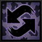
            Prowl
        

        Move
    

    <table style="width: 100%; border-collapse: collapse; margin: 0; font-size: 0.9em; background-color: #242424;">
        <thead>
            <tr style="background-color: #1a1a1a; color: #bfa67a; font-weight: bold; border-bottom: 1px solid #383830;">
                <th style="padding: 8px; text-align: center; width: 30%;">Rank</th>
                <th style="padding: 8px; text-align: left; width: 70%;">Self</th>
            </tr>
        </thead>
        <tbody>
            <tr style="border-bottom: 1px solid #383830; text-align: center;">
                <td style="padding: 10px; font-size: 1.2em; letter-spacing: 2px; vertical-align: middle;">
                    ● ● ● ●
                </td>
                <td style="padding: 10px; text-align: left; vertical-align: middle;">
                    

                        Back 3 
                        Stealth (1 rd)
                    

                </td>
            </tr>
        </tbody>
    </table>

---

<!-- COMBAT TYPE SKILL (RED) -->

    

        

            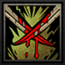
            Feral Cuts
        

        Melee
    

    <table style="width: 100%; border-collapse: collapse; margin: 0; font-size: 0.9em; background-color: #242424;">
        <thead>
            <tr style="background-color: #1a1a1a; color: #bfa67a; font-weight: bold; border-bottom: 1px solid #383830;">
                <th style="padding: 8px; text-align: center; width: 15%;">Rank</th>
                <th style="padding: 8px; text-align: center; width: 15%;">Target</th>
                <th style="padding: 8px; text-align: center; width: 10%;">Damage</th>
                <th style="padding: 8px; text-align: center; width: 10%;">Accuracy</th>
                <th style="padding: 8px; text-align: center; width: 10%;">Crit Mod</th>
                <th style="padding: 8px; text-align: left; width: 25%;">Effect</th>
                <th style="padding: 8px; text-align: left; width: 15%;">Self</th>
            </tr>
        </thead>
        <tbody>
            <tr style="border-bottom: 1px solid #383830; text-align: center;">
                <td style="padding: 10px; font-size: 1.2em; letter-spacing: 2px; vertical-align: middle;">x x ● ●</td>
                <td style="padding: 10px; font-size: 1.2em; letter-spacing: 2px; vertical-align: middle;">● ● ● x</td>
                <td style="padding: 10px; vertical-align: middle;">-60%</td>
                <td style="padding: 10px; vertical-align: middle;">90</td>
                <td style="padding: 10px; vertical-align: middle;">+4.0%</td>
                <td style="padding: 10px; text-align: left; vertical-align: middle;">
                    

                        +5 CRIT vs Beasts 
                        Doublestrike (Attacks Twice / May Use Prowl After the First)
                    

                </td>
                <td style="padding: 10px; text-align: left; vertical-align: middle;">
                    

                        De-Stealth
                    

                </td>
            </tr>
        </tbody>
    </table>

---

<!-- BUFF/DEFENSE TYPE SKILL (BLUE) -->

    

        

            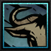
            Unwavering
        

        Buff
    

    <table style="width: 100%; border-collapse: collapse; margin: 0; font-size: 0.9em; background-color: #242424;">
        <thead>
            <tr style="background-color: #1a1a1a; color: #bfa67a; font-weight: bold; border-bottom: 1px solid #383830;">
                <th style="padding: 8px; text-align: center; width: 20%;">Rank</th>
                <th style="padding: 8px; text-align: center; width: 20%;">Effect</th>
                <th style="padding: 8px; text-align: left; width: 60%;">Self</th>
            </tr>
        </thead>
        <tbody>
            <tr style="border-bottom: 1px solid #383830; text-align: center;">
                <td style="padding: 10px; font-size: 1.2em; letter-spacing: 2px; vertical-align: middle;">
                    x ● ● ●
                </td>
                <td style="padding: 10px; vertical-align: middle;">
                    Cooldown: 1 rd
                </td>
                <td style="padding: 10px; text-align: left; vertical-align: middle;">
                    

                        1 Block 
                        When Hit: Counter Once: 95 ACC Base / +20% DMG / +2% CRIT
                    

                </td>
            </tr>
        </tbody>
    </table>

---

<!-- COMBAT TYPE SKILL (RED) -->

    

        

            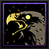
            Bird of Prey
        

        Melee
    

    <table style="width: 100%; border-collapse: collapse; margin: 0; font-size: 0.9em; background-color: #242424;">
        <thead>
            <tr style="background-color: #1a1a1a; color: #bfa67a; font-weight: bold; border-bottom: 1px solid #383830;">
                <th style="padding: 8px; text-align: center; width: 15%;">Rank</th>
                <th style="padding: 8px; text-align: center; width: 15%;">Target</th>
                <th style="padding: 8px; text-align: center; width: 10%;">Damage</th>
                <th style="padding: 8px; text-align: center; width: 10%;">Accuracy</th>
                <th style="padding: 8px; text-align: center; width: 10%;">Crit Mod</th>
                <th style="padding: 8px; text-align: left; width: 25%;">Effect</th>
                <th style="padding: 8px; text-align: left; width: 15%;">Self</th>
            </tr>
        </thead>
        <tbody>
            <tr style="border-bottom: 1px solid #383830; text-align: center;">
                <td style="padding: 10px; font-size: 1.2em; letter-spacing: 2px; vertical-align: middle;">● x x x</td>
                <td style="padding: 10px; font-size: 1.2em; letter-spacing: 2px; vertical-align: middle;">x ● ● ●</td>
                <td style="padding: 10px; vertical-align: middle;">+10%</td>
                <td style="padding: 10px; vertical-align: middle;">90</td>
                <td style="padding: 10px; vertical-align: middle;">+2.0%</td>
                <td style="padding: 10px; text-align: left; vertical-align: middle;">
                    

                        Bypass Stealth 
                        Transfer Stealth 
                        +10 ACC vs Stealthed / +30% DMG vs Stealthed
                    

                </td>
                <td style="padding: 10px; text-align: left; vertical-align: middle;">
                    

                        Forward 3
                    

                </td>
            </tr>
        </tbody>
    </table>

---

<!-- COMBAT TYPE SKILL (RED) -->

    

        

            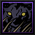
            Cougar's Leap
        

        Melee
    

    <table style="width: 100%; border-collapse: collapse; margin: 0; font-size: 0.9em; background-color: #242424;">
        <thead>
            <tr style="background-color: #1a1a1a; color: #bfa67a; font-weight: bold; border-bottom: 1px solid #383830;">
                <th style="padding: 8px; text-align: center; width: 15%;">Rank</th>
                <th style="padding: 8px; text-align: center; width: 15%;">Target</th>
                <th style="padding: 8px; text-align: center; width: 10%;">Damage</th>
                <th style="padding: 8px; text-align: center; width: 10%;">Accuracy</th>
                <th style="padding: 8px; text-align: center; width: 10%;">Crit Mod</th>
                <th style="padding: 8px; text-align: left; width: 25%;">Effect</th>
                <th style="padding: 8px; text-align: left; width: 15%;">Self</th>
            </tr>
        </thead>
        <tbody>
            <tr style="border-bottom: 1px solid #383830; text-align: center;">
                <td style="padding: 10px; font-size: 1.2em; letter-spacing: 2px; vertical-align: middle;">● ● ● ●</td>
                <td style="padding: 10px; font-size: 1.2em; letter-spacing: 2px; vertical-align: middle;">● ● x x</td>
                <td style="padding: 10px; vertical-align: middle;">-40%</td>
                <td style="padding: 10px; vertical-align: middle;">85</td>
                <td style="padding: 10px; vertical-align: middle;">+2.0%</td>
                <td style="padding: 10px; text-align: left; vertical-align: middle;">
                    

                        Bleed (110% Base) 3pts/rd for 2 rds 
                        +25 CRIT While Stealthed
                    

                </td>
                <td style="padding: 10px; text-align: left; vertical-align: middle;">
                    

                        Forward 1 
                        On Miss: Stealth (1 rd)
                    

                </td>
            </tr>
        </tbody>
    </table>

---
<!-- COMBAT TYPE SKILL (RED) -->

    

        

            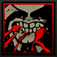
            Ravenous
        

        Melee
    

    <table style="width: 100%; border-collapse: collapse; margin: 0; font-size: 0.9em; background-color: #242424;">
        <thead>
            <tr style="background-color: #1a1a1a; color: #bfa67a; font-weight: bold; border-bottom: 1px solid #383830;">
                <th style="padding: 8px; text-align: center; width: 15%;">Rank</th>
                <th style="padding: 8px; text-align: center; width: 15%;">Target</th>
                <th style="padding: 8px; text-align: center; width: 10%;">Damage</th>
                <th style="padding: 8px; text-align: center; width: 10%;">Accuracy</th>
                <th style="padding: 8px; text-align: center; width: 10%;">Crit Mod</th>
                <th style="padding: 8px; text-align: left; width: 20%;">Effect</th>
                <th style="padding: 8px; text-align: left; width: 20%;">Self</th>
            </tr>
        </thead>
        <tbody>
            <tr style="border-bottom: 1px solid #383830; text-align: center;">
                <td style="padding: 10px; font-size: 1.2em; letter-spacing: 2px; vertical-align: middle;">x x ● ●</td>
                <td style="padding: 10px; font-size: 1.2em; letter-spacing: 2px; vertical-align: middle;">● ● x x</td>
                <td style="padding: 10px; vertical-align: middle;">-70%</td>
                <td style="padding: 10px; vertical-align: middle;">95</td>
                <td style="padding: 10px; vertical-align: middle;">+8.0%</td>
                <td style="padding: 10px; text-align: left; vertical-align: middle;">
                    

                        Bleed (100% Base) 4pts/rd for 2 rds 
                        Consume Corpse
                    

                </td>
                <td style="padding: 10px; text-align: left; vertical-align: middle;">
                    

                        If Corpse Consumed: Heal 1pts/rd for 2rds 
                        +10% Bleed Amount (Quest)
                    

                </td>
            </tr>
        </tbody>
    </table>

---

<!-- SUMMON TYPE SKILL (RED) -->

    

        

            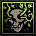
            Circle of Life
        

        Summon
    

    <table style="width: 100%; border-collapse: collapse; margin: 0; font-size: 0.9em; background-color: #242424;">
        <thead>
            <tr style="background-color: #1a1a1a; color: #bfa67a; font-weight: bold; border-bottom: 1px solid #383830;">
                <th style="padding: 8px; text-align: center; width: 20%;">Rank</th>
                <th style="padding: 8px; text-align: center; width: 20%;">Target</th>
                <th style="padding: 8px; text-align: left; width: 30%;">Effect</th>
                <th style="padding: 8px; text-align: left; width: 30%;">Self</th>
            </tr>
        </thead>
        <tbody>
            <tr style="border-bottom: 1px solid #383830; text-align: center;">
                <td style="padding: 10px; font-size: 1.2em; letter-spacing: 2px; vertical-align: middle;">● ● x x</td>
                <td style="padding: 10px; font-size: 1.2em; letter-spacing: 2px; vertical-align: middle;">● ● ● ●</td>
                <td style="padding: 10px; text-align: left; vertical-align: middle;">
                    

                        Uses Per Battle: 1 
                        Consume Corpse
                    

                </td>
                <td style="padding: 10px; text-align: left; vertical-align: middle;">
                    

                        Summon Corpsebud
                    

                </td>
            </tr>
        </tbody>
    </table>

---

<!-- HEAL/SUPPORT TYPE SKILL (GREEN) -->

    

        

            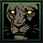
            Spirit of the Hunt
        

        Heal
    

    <table style="width: 100%; border-collapse: collapse; margin: 0; font-size: 0.9em; background-color: #242424;">
        <thead>
            <tr style="background-color: #1a1a1a; color: #bfa67a; font-weight: bold; border-bottom: 1px solid #383830;">
                <th style="padding: 8px; text-align: center; width: 25%;">Rank</th>
                <th style="padding: 8px; text-align: center; width: 25%;">Target</th>
                <th style="padding: 8px; text-align: left; width: 50%;">Effect</th>
            </tr>
        </thead>
        <tbody>
            <tr style="border-bottom: 1px solid #383830;">
                <td style="padding: 10px; text-align: center; font-size: 1.2em; letter-spacing: 2px; vertical-align: middle;">
                    ● ● ● x
                </td>
                <td style="padding: 10px; text-align: center; font-size: 1.2em; letter-spacing: 2px; vertical-align: middle;">
                    ● ● ● ●
                </td>
                <td style="padding: 10px; text-align: left; line-height: 1.5; vertical-align: middle;">
                    Uses Per Battle: 1 
                    Next Attack Kill: Heal 20% Max HP 
                    Stress -8 
                    Buff Target: +10% DMG
                </td>
            </tr>
        </tbody>
    </table>

---

## Camping Skills

The Beastmaster's camping skills emphasize wilderness survival, exploration, and natural healing. He can gather resources unique to the surrounding environment, improve the party's scouting capabilities, and use shamanic remedies to cure his own diseases while producing rare medicinal ingredients.

<!-- CAMPING SKILL CARD -->

    

        

            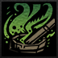
            Shamanism
        

        Cost: 4 Time
    

    <table style="width: 100%; border-collapse: collapse; margin: 0; font-size: 0.9em; background-color: #242424;">
        <tr style="background-color: #1a1a1a; color: #bfa67a; font-weight: bold; border-bottom: 1px solid #383830;">
            <th style="padding: 8px; text-align: left; width: 25%;">Target</th>
            <th style="padding: 8px; text-align: left; width: 75%;">Effects</th>
        </tr>
        <tr>
            <td style="padding: 12px; color: #e2d6b5; vertical-align: top; border-right: 1px solid #383830; font-weight: bold;">
                Self Only
            </td>
            <td style="padding: 12px; color: #e2d6b5; vertical-align: top; line-height: 1.4;">
                Search for Herbs Cure Disease All Companions: Cure Disease (50% Chance)
            </td>
        </tr>
    </table>

---

<!-- CAMPING SKILL CARD -->

    

        

            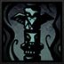
            Totemic Guidance
        

        Cost: 5 Time
    

    <table style="width: 100%; border-collapse: collapse; margin: 0; font-size: 0.9em; background-color: #242424;">
        <tr style="background-color: #1a1a1a; color: #bfa67a; font-weight: bold; border-bottom: 1px solid #383830;">
            <th style="padding: 8px; text-align: left; width: 25%;">Target</th>
            <th style="padding: 8px; text-align: left; width: 75%;">Effects</th>
        </tr>
        <tr>
            <td style="padding: 12px; color: #e2d6b5; vertical-align: top; border-right: 1px solid #383830; font-weight: bold;">
                Self Only
            </td>
            <td style="padding: 12px; color: #e2d6b5; vertical-align: top; line-height: 1.4;">
                Prevents Nighttime Ambush -10% Chance Party Surprised (4 Battles) Produce a Totem
            </td>
        </tr>
    </table>

---

<!-- CAMPING SKILL CARD -->

    

        

            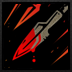
            Big Game Hunt
        

        Cost: 4 Time
    

    <table style="width: 100%; border-collapse: collapse; margin: 0; font-size: 0.9em; background-color: #242424;">
        <tr style="background-color: #1a1a1a; color: #bfa67a; font-weight: bold; border-bottom: 1px solid #383830;">
            <th style="padding: 8px; text-align: left; width: 25%;">Target</th>
            <th style="padding: 8px; text-align: left; width: 75%;">Effects</th>
        </tr>
        <tr>
            <td style="padding: 12px; color: #e2d6b5; vertical-align: top; border-right: 1px solid #383830; font-weight: bold;">
                Party
            </td>
            <td style="padding: 12px; color: #e2d6b5; vertical-align: top; line-height: 1.4;">
                +20% Bleed Amount (4 Battles) +20% DMG vs Size 2+ (4 Battles)
            </td>
        </tr>
    </table>

---

<!-- CAMPING SKILL CARD -->

    

        

            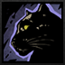
            Prey Stalker
        

        Cost: 3 Time
    

    <table style="width: 100%; border-collapse: collapse; margin: 0; font-size: 0.9em; background-color: #242424;">
        <tr style="background-color: #1a1a1a; color: #bfa67a; font-weight: bold; border-bottom: 1px solid #383830;">
            <th style="padding: 8px; text-align: left; width: 25%;">Target</th>
            <th style="padding: 8px; text-align: left; width: 75%;">Effects</th>
        </tr>
        <tr>
            <td style="padding: 12px; color: #e2d6b5; vertical-align: top; border-right: 1px solid #383830; font-weight: bold;">
                Self Only
            </td>
            <td style="padding: 12px; color: #e2d6b5; vertical-align: top; line-height: 1.4;">
                +10% Chance Monsters Surprised (4 Battles) +10 ACC On First Round (4 Battles) +10 ACC While Stealthed
            </td>
        </tr>
    </table>

---

<!-- CAMPING SKILL CARD -->

    

        

            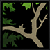
            Wildlife Expertise
        

        Cost: 2 Time
    

    <table style="width: 100%; border-collapse: collapse; margin: 0; font-size: 0.9em; background-color: #242424;">
        <tr style="background-color: #1a1a1a; color: #bfa67a; font-weight: bold; border-bottom: 1px solid #383830;">
            <th style="padding: 8px; text-align: left; width: 25%;">Target</th>
            <th style="padding: 8px; text-align: left; width: 75%;">Effects</th>
        </tr>
        <tr>
            <td style="padding: 12px; color: #e2d6b5; vertical-align: top; border-right: 1px solid #383830;">
                Self Only Uses Remaining: 2
            </td>
            <td style="padding: 12px; color: #e2d6b5; vertical-align: top; line-height: 1.4;">
                +5% Scouting Chance (4 Battles) Search for Herbs Search for Food
            </td>
        </tr>
    </table>

---

## Equipment

The Beastmaster wields a hunting spear alongside the spiritual essence of beasts that inhabit his tattooed body. His tribal attire, adorned with hides, bones, and ritual fetishes, reflects his role as both hunter and shaman of the wilds.

---

## Monsters

Base Stats

MAX HP: <strong style="color: #e2d6b5;">6</strong>

DODGE: <strong style="color: #e2d6b5;">0</strong>

PROT: <strong style="color: #e2d6b5;">0%</strong>

SPD: <strong style="color: #e2d6b5;">5</strong>

Actions: <strong style="color: #e2d6b5;">1</strong>

Type: <strong style="color: #e2d6b5;">Vegetation</strong>

<table style="width: 100%; border-collapse: collapse; background-color: #242424; font-size: 0.85em; margin-bottom: 24px; border: 1px solid #383830;">
<tr style="background-color: #1a1a1a; color: #bfa67a; font-weight: bold; border-bottom: 1px solid #383830;">
<th style="padding: 6px 10px; text-align: left; width: 35%;">Resistance</th>
<th style="padding: 6px 10px; text-align: center; width: 15%;">Base</th>
<th style="padding: 6px 10px; text-align: left; width: 35%;">Resistance</th>
<th style="padding: 6px 10px; text-align: center; width: 15%;">Base</th>
</tr>
<tr style="border-bottom: 1px solid #383830;">
<td style="padding: 6px 10px; color: #e2d6b5;"> <strong style="font-weight: bold;">Stun</strong></td>
<td style="padding: 6px 10px; text-align: center; color: #e2d6b5;">300%</td>
<td style="padding: 6px 10px; color: #e2d6b5;"> <strong style="font-weight: bold;">Bleed</strong></td>
<td style="padding: 6px 10px; text-align: center; color: #e2d6b5;">300%</td>
</tr>
<tr style="border-bottom: 1px solid #383830;">
<td style="padding: 6px 10px; color: #e2d6b5;"> <strong style="font-weight: bold;">Blight</strong></td>
<td style="padding: 6px 10px; text-align: center; color: #e2d6b5;">0%</td>
<td style="padding: 6px 10px; color: #e2d6b5;"> <strong style="font-weight: bold;">Move</strong></td>
<td style="padding: 6px 10px; text-align: center; color: #e2d6b5;">300%</td>
</tr>
<tr>
<td style="padding: 6px 10px; color: #e2d6b5;"> <strong style="font-weight: bold;">Debuff</strong></td>
<td style="padding: 6px 10px; text-align: center; color: #e2d6b5;">300%</td>
<td style="padding: 6px 10px; color: #e2d6b5;"> <strong style="font-weight: bold;">Disease</strong></td>
<td style="padding: 6px 10px; text-align: center; color: #e2d6b5;">-</td>
</tr>
</table>

Combat Skills

<strong style="color: #fffb82; font-size: 0.95em;">Entangle</strong>
● ● ● ●  |  ● ● ● ●

Base ACC: 92.5 | CRIT: -10% Stun (90% Base) / Debuff Target: -5 DODGE

<strong style="color: #fffb82; font-size: 0.95em;">Thornsnap</strong>
● ● ● ●  |  ● ● ● ●

Base ACC: 92.5 | CRIT: 10% 1-7 DMG / Bleed (2 pts/rd for 1 rds).

<strong style="color: #fffb82; font-size: 0.95em;">Bloom</strong>
● ● ● ● |  ● ● ● ●

Base ACC: 192.5 | CRIT: 0% Heal 2pts/rd for 2 rds

<strong style="color: #fffb82; font-size: 0.95em;">Proliferate</strong>
● ● ● ●

Base ACC: 192.5 | CRIT: 0% Remove Enemy Corpses / Summon Corpseflower

Corpseflower

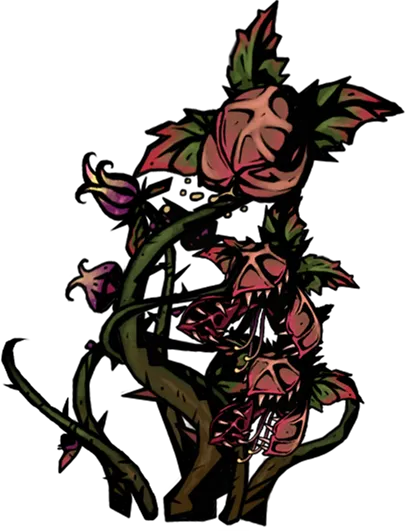

Summoned when "Circle of Life" is used.

---

## Trivia

* Canon name is Mukanda.
* Cannot visit Disease Treatment, Gambling Hall and Transcept.
* Cannot develop quirks which are negative vs beast or in Weald.
* Can't go with other Beastmasters in party.

<!-- Lore Comic Section -->

    

