---
cssclasses:
  - wide-page
title: Falconer
tags:
  - bleed
  - backline
  - mark
  - stealth
  - outsiders-bonfire
---
# Falconer

<!-- MAIN LEFT COLUMN: BIO & DESCRIPTION -->

    
"Predators require neither malice nor hatred to kill. Their mistress, regrettably, possesses both."

    
— The Ancestor

### Class Description
A defected criminal turned skilled huntress, the Falconer excels at disrupting enemy formations and exploiting exposed prey alongside her loyal falcon. A highly adaptable ranged combatant, she combines precision archery, mobility, and coordinated attacks to remain effective in nearly any situation.

<!-- WIKI RIGHT COLUMN: INFOBOX -->

    
FALCONER

    

    

    <table style="width: 100%; margin: 0; border-collapse: collapse; font-size: 0.95em; clear: both;">
        <tr style="border-bottom: 1px solid var(--background-modifier-border);"><td style="padding: 6px 0;"><b>Movement</b></td><td style="text-align: right; padding: 6px 0;">1 Fwd, 2 Back</td></tr>
        <tr style="border-bottom: 1px solid var(--background-modifier-border);"><td style="padding: 6px 0;"><b>Crit Buff</b></td><td style="text-align: right; padding: 6px 0; color: #ffbc42;">+5 ACC / +1 SPD</td></tr>
        <tr style="border-bottom: 1px solid var(--background-modifier-border);"><td style="padding: 6px 0;"><b>Religious</b></td><td style="text-align: right; padding: 6px 0;">No</td></tr>
        <tr><td style="padding: 6px 0;"><b>Provisions</b></td><td style="text-align: right; padding: 6px 0;">Food x2</td></tr>
    </table>

---

## Base Stats

<table style="width: 100%; border-collapse: collapse; background-color: #242424; margin-top: 10px; margin-bottom: 24px;">
    <tr style="background-color: #1a1a1a; color: #bfa67a; font-weight: bold; border-bottom: 1px solid #383830;">
        <th style="padding: 8px; text-align: left; width: 40%;">Attribute</th>
        <th style="padding: 8px; text-align: center; width: 30%;">Resolve 1</th>
        <th style="padding: 8px; text-align: center; width: 30%;">Resolve 5</th>
    </tr>
    <tr style="border-bottom: 1px solid #383830;">
        <td style="padding: 8px; vertical-align: middle; color: #e2d6b5; font-weight: bold;">MAX HP</td>
        <td style="padding: 8px; text-align: center; vertical-align: middle; color: #e2d6b5;">23</td>
        <td style="padding: 8px; text-align: center; vertical-align: middle; color: #e2d6b5;">43</td>
    </tr>
    <tr style="border-bottom: 1px solid #383830;">
        <td style="padding: 8px; vertical-align: middle; color: #e2d6b5; font-weight: bold;">DODGE</td>
        <td style="padding: 8px; text-align: center; vertical-align: middle; color: #e2d6b5;">5%</td>
        <td style="padding: 8px; text-align: center; vertical-align: middle; color: #e2d6b5;">25%</td>
    </tr>
    <tr style="border-bottom: 1px solid #383830;">
        <td style="padding: 8px; vertical-align: middle; color: #e2d6b5; font-weight: bold;">PROT</td>
        <td style="padding: 8px; text-align: center; vertical-align: middle; color: #e2d6b5;">0%</td>
        <td style="padding: 8px; text-align: center; vertical-align: middle; color: #e2d6b5;">0%</td>
    </tr>
    <tr style="border-bottom: 1px solid #383830;">
        <td style="padding: 8px; vertical-align: middle; color: #e2d6b5; font-weight: bold;">SPD</td>
        <td style="padding: 8px; text-align: center; vertical-align: middle; color: #e2d6b5;">0</td>
        <td style="padding: 8px; text-align: center; vertical-align: middle; color: #e2d6b5;">0</td>
    </tr>
    <tr style="border-bottom: 1px solid #383830;">
        <td style="padding: 8px; vertical-align: middle; color: #e2d6b5; font-weight: bold;">ACC MOD</td>
        <td style="padding: 8px; text-align: center; vertical-align: middle; color: #e2d6b5;">0</td>
        <td style="padding: 8px; text-align: center; vertical-align: middle; color: #e2d6b5;">0</td>
    </tr>
    <tr style="border-bottom: 1px solid #383830;">
        <td style="padding: 8px; vertical-align: middle; color: #e2d6b5; font-weight: bold;">CRIT</td>
        <td style="padding: 8px; text-align: center; vertical-align: middle; color: #e2d6b5;">7%</td>
        <td style="padding: 8px; text-align: center; vertical-align: middle; color: #e2d6b5;">11%</td>
    </tr>
    <tr>
        <td style="padding: 8px; vertical-align: middle; color: #e2d6b5; font-weight: bold;">DMG</td>
        <td style="padding: 8px; text-align: center; vertical-align: middle; color: #e2d6b5;">4 - 7</td>
        <td style="padding: 8px; text-align: center; vertical-align: middle; color: #e2d6b5;">7 - 11</td>
    </tr>
</table>

### Resistances

<table style="width: 100%; border-collapse: collapse; background-color: #242424; margin-top: 10px;">
    <tr style="background-color: #1a1a1a; color: #bfa67a; font-weight: bold; border-bottom: 1px solid #383830;">
        <th style="padding: 8px; text-align: left; width: 35%;">Type</th>
        <th style="padding: 8px; text-align: center; width: 15%;">Base %</th>
        <th style="padding: 8px; text-align: left; width: 35%;">Type</th>
        <th style="padding: 8px; text-align: center; width: 15%;">Base %</th>
    </tr>
    <tr style="border-bottom: 1px solid #383830;">
        <td style="padding: 8px; vertical-align: middle; color: #e2d6b5;">
             Stun
        </td>
        <td style="padding: 8px; text-align: center; vertical-align: middle; color: #e2d6b5;">30%</td>
        <td style="padding: 8px; vertical-align: middle; color: #e2d6b5;">
             Bleed
        </td>
        <td style="padding: 8px; text-align: center; vertical-align: middle; color: #e2d6b5;">30%</td>
    </tr>
    <tr style="border-bottom: 1px solid #383830;">
        <td style="padding: 8px; vertical-align: middle; color: #e2d6b5;">
             Move
        </td>
        <td style="padding: 8px; text-align: center; vertical-align: middle; color: #e2d6b5;">25%</td>
        <td style="padding: 8px; vertical-align: middle; color: #e2d6b5;">
             Disease
        </td>
        <td style="padding: 8px; text-align: center; vertical-align: middle; color: #e2d6b5;">40%</td>
    </tr>
    <tr style="border-bottom: 1px solid #383830;">
        <td style="padding: 8px; vertical-align: middle; color: #e2d6b5;">
             Blight
        </td>
        <td style="padding: 8px; text-align: center; vertical-align: middle; color: #e2d6b5;">30%</td>
        <td style="padding: 8px; vertical-align: middle; color: #e2d6b5;">
             Debuff
        </td>
        <td style="padding: 8px; text-align: center; vertical-align: middle; color: #e2d6b5;">30%</td>
    </tr>
    <tr>
        <td style="padding: 8px; vertical-align: middle; color: #e2d6b5;">
             Death Blow
        </td>
        <td style="padding: 8px; text-align: center; vertical-align: middle; color: #e2d6b5;">67%</td>
        <td style="padding: 8px; vertical-align: middle; color: #e2d6b5;">
             Trap Disarm
        </td>
        <td style="padding: 8px; text-align: center; vertical-align: middle; color: #e2d6b5;">40%</td>
    </tr>
</table>

---

## Combat Skills Overview

The Falconer's combat skills revolve around ranged attacks, battlefield control, and adaptability. She can mark and debilitate enemies, inflict Bleed, reposition herself with ease, and coordinate devastating strikes with her falcon to capitalize on weakened foes.

### Move List

<!-- COMBAT TYPE SKILL (RED) -->

    

        

            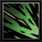
            Quickshot / Crippling Shot
        

        Ranged
    

    <table style="width: 100%; border-collapse: collapse; margin: 0; font-size: 0.9em; background-color: #242424;">
        <thead>
            <tr style="background-color: #1a1a1a; color: #bfa67a; font-weight: bold; border-bottom: 1px solid #383830;">
                <th style="padding: 8px; text-align: center; width: 15%;">Rank</th>
                <th style="padding: 8px; text-align: center; width: 15%;">Target</th>
                <th style="padding: 8px; text-align: center; width: 10%;">Damage</th>
                <th style="padding: 8px; text-align: center; width: 10%;">Accuracy</th>
                <th style="padding: 8px; text-align: center; width: 10%;">Crit Mod</th>
                <th style="padding: 8px; text-align: left; width: 25%;">Effect</th>
                <th style="padding: 8px; text-align: left; width: 15%;">Self</th>
            </tr>
        </thead>
        <tbody>
            <tr style="border-bottom: 1px solid #383830; text-align: center;">
                <td style="padding: 10px; font-size: 1.2em; letter-spacing: 2px; vertical-align: middle;">● ● x x</td>
                <td style="padding: 10px; font-size: 1.2em; letter-spacing: 2px; vertical-align: middle;">x ● ● ●</td>
                <td style="padding: 10px; vertical-align: middle;">+0%</td>
                <td style="padding: 10px; vertical-align: middle;">90</td>
                <td style="padding: 10px; vertical-align: middle;">+9.0%</td>
                <td style="padding: 10px; text-align: left; vertical-align: middle;">
                    

                        +35% DMG vs Marked 
                        Skill 2 
                        Debuff Target: -10 DODGE (100% Base) / -2 SPD (100% Base)
                    

                </td>
                <td style="padding: 10px; text-align: left; vertical-align: middle;">
                    

                        Skill 1 
                        Buff Self: +2 SPD
                    

                </td>
            </tr>
        </tbody>
    </table>

---

<!-- COMBAT TYPE SKILL (RED) -->

    

        

            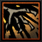
            Eyethief / Ravage
        

        Ranged
    

    <table style="width: 100%; border-collapse: collapse; margin: 0; font-size: 0.9em; background-color: #242424;">
        <thead>
            <tr style="background-color: #1a1a1a; color: #bfa67a; font-weight: bold; border-bottom: 1px solid #383830;">
                <th style="padding: 8px; text-align: center; width: 15%;">Rank</th>
                <th style="padding: 8px; text-align: center; width: 15%;">Target</th>
                <th style="padding: 8px; text-align: center; width: 10%;">Damage</th>
                <th style="padding: 8px; text-align: center; width: 10%;">Accuracy</th>
                <th style="padding: 8px; text-align: center; width: 10%;">Crit Mod</th>
                <th style="padding: 8px; text-align: left; width: 25%;">Effect</th>
                <th style="padding: 8px; text-align: left; width: 15%;">Self</th>
            </tr>
        </thead>
        <tbody>
            <tr style="border-bottom: 1px solid #383830; text-align: center;">
                <td style="padding: 10px; font-size: 1.2em; letter-spacing: 2px; vertical-align: middle;">● ● ● ●</td>
                <td style="padding: 10px; font-size: 1.2em; letter-spacing: 2px; vertical-align: middle;">● ● ● ●</td>
                <td style="padding: 10px; vertical-align: middle;">-75%</td>
                <td style="padding: 10px; vertical-align: middle;">95</td>
                <td style="padding: 10px; vertical-align: middle;">+8.0%</td>
                <td style="padding: 10px; text-align: left; vertical-align: middle;">
                    

                        Bypass Stealth 
                        De-Stealth 
                        Debuff Target: -10 ACC (100% Base) 
                        Skill 1 
                        Mark Target 
                        Skill 2 
                        Bleed (100% Base) 2pts/rd for 2rds 
                        +100% Bleed Amount vs Marked
                    

                </td>
                <td style="padding: 10px; text-align: left; vertical-align: middle;">
                    

                        -
                    

                </td>
            </tr>
        </tbody>
    </table>

---

<!-- COMBAT TYPE SKILL (RED) -->

    

        

            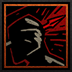
            Flank / Gouge
        

        Melee
    

    <table style="width: 100%; border-collapse: collapse; margin: 0; font-size: 0.9em; background-color: #242424;">
        <thead>
            <tr style="background-color: #1a1a1a; color: #bfa67a; font-weight: bold; border-bottom: 1px solid #383830;">
                <th style="padding: 8px; text-align: center; width: 15%;">Rank</th>
                <th style="padding: 8px; text-align: center; width: 15%;">Target</th>
                <th style="padding: 8px; text-align: center; width: 10%;">Damage</th>
                <th style="padding: 8px; text-align: center; width: 10%;">Accuracy</th>
                <th style="padding: 8px; text-align: center; width: 10%;">Crit Mod</th>
                <th style="padding: 8px; text-align: left; width: 25%;">Effect</th>
                <th style="padding: 8px; text-align: left; width: 15%;">Self</th>
            </tr>
        </thead>
        <tbody>
            <tr style="border-bottom: 1px solid #383830; text-align: center;">
                <td style="padding: 10px; font-size: 1.2em; letter-spacing: 2px; vertical-align: middle;">x x ● ●</td>
                <td style="padding: 10px; font-size: 1.2em; letter-spacing: 2px; vertical-align: middle;">● ● x x</td>
                <td style="padding: 10px; vertical-align: middle;">+0%</td>
                <td style="padding: 10px; vertical-align: middle;">85</td>
                <td style="padding: 10px; vertical-align: middle;">+5.0%</td>
                <td style="padding: 10px; text-align: left; vertical-align: middle;">
                    

                        Forward 1 
                        +50% DMG While Stealthed 
                        Debuff Target: -10 ACC (100% Base) 
                        Skill 1 
                        Armor Piercing vs Marked 
                        Skill 2 
                        +35% DMG vs Bleeding
                    

                </td>
                <td style="padding: 10px; text-align: left; vertical-align: middle;">
                    

                        -
                    

                </td>
            </tr>
        </tbody>
    </table>

---

<!-- COMBAT TYPE SKILL (RED) -->

    

        

            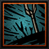
            Volley Fire / Flurry
        

        Ranged
    

    <table style="width: 100%; border-collapse: collapse; margin: 0; font-size: 0.9em; background-color: #242424;">
        <thead>
            <tr style="background-color: #1a1a1a; color: #bfa67a; font-weight: bold; border-bottom: 1px solid #383830;">
                <th style="padding: 8px; text-align: center; width: 15%;">Rank</th>
                <th style="padding: 8px; text-align: center; width: 15%;">Target</th>
                <th style="padding: 8px; text-align: center; width: 10%;">Damage</th>
                <th style="padding: 8px; text-align: center; width: 10%;">Accuracy</th>
                <th style="padding: 8px; text-align: center; width: 10%;">Crit Mod</th>
                <th style="padding: 8px; text-align: left; width: 25%;">Effect</th>
                <th style="padding: 8px; text-align: left; width: 15%;">Self</th>
            </tr>
        </thead>
        <tbody>
            <tr style="border-bottom: 1px solid #383830; text-align: center;">
                <td style="padding: 10px; font-size: 1.2em; letter-spacing: 2px; vertical-align: middle;">● ● x x</td>
                <td style="padding: 10px; font-size: 1.2em; letter-spacing: 2px; vertical-align: middle;">x ●-●-●</td>
                <td style="padding: 10px; vertical-align: middle;">-40%</td>
                <td style="padding: 10px; vertical-align: middle;">90</td>
                <td style="padding: 10px; vertical-align: middle;">-4.0%</td>
                <td style="padding: 10px; text-align: left; vertical-align: middle;">
                    

                        Skill 1 
                        None
                    

                </td>
                <td style="padding: 10px; text-align: left; vertical-align: middle;">
                    

                        Skill 2 
                        Shuffle Target (90% Base) 
                        -75% DMG 
                        Debuff Target: -10 ACC (100% Base)
                    

                </td>
            </tr>
        </tbody>
    </table>

<!-- BUFF/DEFENSE TYPE SKILL (BLUE) -->

    

        

            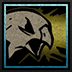
            Spirited Cry / Stalk
        

        Buff
    

    <table style="width: 100%; border-collapse: collapse; margin: 0; font-size: 0.9em; background-color: #242424;">
        <thead>
            <tr style="background-color: #1a1a1a; color: #bfa67a; font-weight: bold; border-bottom: 1px solid #383830;">
                <th style="padding: 8px; text-align: center; width: 20%;">Rank</th>
                <th style="padding: 8px; text-align: left; width: 40%;">Effect</th>
                <th style="padding: 8px; text-align: left; width: 40%;">Self</th>
            </tr>
        </thead>
        <tbody>
            <tr style="border-bottom: 1px solid #383830; text-align: center;">
                <td style="padding: 10px; font-size: 1.2em; letter-spacing: 2px; vertical-align: middle;">
                    ● ● x x
                </td>
                <td style="padding: 10px; text-align: left; vertical-align: middle;">
                    

                        Skill 1 
                        De-Stealth 
                        All Heroes: Clear Stun / +7 CRIT / Stress: -1
                    

                </td>
                <td style="padding: 10px; text-align: left; vertical-align: middle;">
                    

                        Skill 2 
                        Stealth (4rds) / +15 CRIT while Stealthed
                    

                </td>
            </tr>
        </tbody>
    </table>

---

<!-- COMBAT TYPE SKILL (RED) -->

    

        

            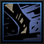
            Fleeting Escape / Harrier
        

        Ranged
    

    <table style="width: 100%; border-collapse: collapse; margin: 0; font-size: 0.9em; background-color: #242424;">
        <thead>
            <tr style="background-color: #1a1a1a; color: #bfa67a; font-weight: bold; border-bottom: 1px solid #383830;">
                <th style="padding: 8px; text-align: center; width: 15%;">Rank</th>
                <th style="padding: 8px; text-align: center; width: 15%;">Target</th>
                <th style="padding: 8px; text-align: center; width: 10%;">Damage</th>
                <th style="padding: 8px; text-align: center; width: 10%;">Accuracy</th>
                <th style="padding: 8px; text-align: center; width: 10%;">Crit Mod</th>
                <th style="padding: 8px; text-align: left; width: 25%;">Effect</th>
                <th style="padding: 8px; text-align: left; width: 15%;">Self</th>
            </tr>
        </thead>
        <tbody>
            <tr style="border-bottom: 1px solid #383830; text-align: center;">
                <td style="padding: 10px; font-size: 1.2em; letter-spacing: 2px; vertical-align: middle;">x x ● ●</td>
                <td style="padding: 10px; font-size: 1.2em; letter-spacing: 2px; vertical-align: middle;">●-●</td>
                <td style="padding: 10px; vertical-align: middle;">-66%</td>
                <td style="padding: 10px; vertical-align: middle;">95</td>
                <td style="padding: 10px; vertical-align: middle;">-1.0%</td>
                <td style="padding: 10px; text-align: left; vertical-align: middle;">
                    

                        Back 2 
                        Debuff Target: -7 ACC (100% Base) 
                        Skill 2 
                        Knockback 1 (90% Base) 
                        +100% DMG
                    

                </td>
                <td style="padding: 10px; text-align: left; vertical-align: middle;">
                    

                        Skill 1 
                        Stealth (2rds) (66% Chance) 
                        Clear Marked Target
                    

                </td>
            </tr>
        </tbody>
    </table>

---

<!-- BUFF/DEFENSE TYPE SKILL (BLUE) -->

    

        

            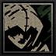
            Adapt
        

        Swap
    

    <table style="width: 100%; border-collapse: collapse; margin: 0; font-size: 0.9em; background-color: #242424;">
        <thead>
            <tr style="background-color: #1a1a1a; color: #bfa67a; font-weight: bold; border-bottom: 1px solid #383830;">
                <th style="padding: 8px; text-align: center; width: 20%;">Rank</th>
                <th style="padding: 8px; text-align: left; width: 40%;">Effect</th>
                <th style="padding: 8px; text-align: left; width: 40%;">Self</th>
            </tr>
        </thead>
        <tbody>
            <tr style="border-bottom: 1px solid #383830; text-align: center;">
                <td style="padding: 10px; font-size: 1.2em; letter-spacing: 2px; vertical-align: middle;">
                    ● ● ● ●
                </td>
                <td style="padding: 10px; text-align: left; vertical-align: middle;">
                    

                        Does Not End Turn 
                        Always Reverts to Skill Set 1 After Every Combat Action
                    

                </td>
                <td style="padding: 10px; text-align: left; vertical-align: middle;">
                    

                        Skill 1 
                        Change to Mode: Skill Set 2 
                        Skill 2 
                        Change to Mode: Skill Set 1
                    

                </td>
            </tr>
        </tbody>
    </table>

---

## Camping Skills

The Falconer's camping skills reflect her expertise as a seasoned hunter and survivalist. She provides scouting and anti-ambush utility while granting buffs that improve the party's awareness, accuracy, and effectiveness during expeditions.

<!-- CAMPING SKILL CARD -->

    

        

            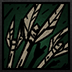
            Fletchery
        

        Cost: 2 Time
    

    <table style="width: 100%; border-collapse: collapse; margin: 0; font-size: 0.9em; background-color: #242424;">
        <tr style="background-color: #1a1a1a; color: #bfa67a; font-weight: bold; border-bottom: 1px solid #383830;">
            <th style="padding: 8px; text-align: left; width: 25%;">Target</th>
            <th style="padding: 8px; text-align: left; width: 75%;">Effects</th>
        </tr>
        <tr>
            <td style="padding: 12px; color: #e2d6b5; vertical-align: top; border-right: 1px solid #383830; font-weight: bold;">
                Self Only
            </td>
            <td style="padding: 12px; color: #e2d6b5; vertical-align: top; line-height: 1.4;">
                +10 ACC Ranged Skills (4 Battles) +5% CRIT Ranged Skills (4 Battles)
            </td>
        </tr>
    </table>

---

<!-- CAMPING SKILL CARD -->

    

        

            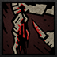
            Scavenge
        

        Cost: 3 Time
    

    <table style="width: 100%; border-collapse: collapse; margin: 0; font-size: 0.9em; background-color: #242424;">
        <tr style="background-color: #1a1a1a; color: #bfa67a; font-weight: bold; border-bottom: 1px solid #383830;">
            <th style="padding: 8px; text-align: left; width: 25%;">Target</th>
            <th style="padding: 8px; text-align: left; width: 75%;">Effects</th>
        </tr>
        <tr>
            <td style="padding: 12px; color: #e2d6b5; vertical-align: top; border-right: 1px solid #383830; font-weight: bold;">
                Self Only
            </td>
            <td style="padding: 12px; color: #e2d6b5; vertical-align: top; line-height: 1.4;">
                +15% Scout Chance (4 Battles) Produce a Random Amount of Food
            </td>
        </tr>
    </table>

---

<!-- CAMPING SKILL CARD -->

    

        

            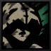
            Camouflage
        

        Cost: 2 Time
    

    <table style="width: 100%; border-collapse: collapse; margin: 0; font-size: 0.9em; background-color: #242424;">
        <tr style="background-color: #1a1a1a; color: #bfa67a; font-weight: bold; border-bottom: 1px solid #383830;">
            <th style="padding: 8px; text-align: left; width: 25%;">Target</th>
            <th style="padding: 8px; text-align: left; width: 75%;">Effects</th>
        </tr>
        <tr>
            <td style="padding: 12px; color: #e2d6b5; vertical-align: top; border-right: 1px solid #383830; font-weight: bold;">
                Self Only
            </td>
            <td style="padding: 12px; color: #e2d6b5; vertical-align: top; line-height: 1.4;">
                +10 ACC While Stealthed (4 Battles) +15% Chance Monsters Surprised (4 Battles)
            </td>
        </tr>
    </table>

---

<!-- CAMPING SKILL CARD -->

    

        

            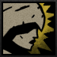
            Heightened Senses
        

        Cost: 4 Time
    

    <table style="width: 100%; border-collapse: collapse; margin: 0; font-size: 0.9em; background-color: #242424;">
        <tr style="background-color: #1a1a1a; color: #bfa67a; font-weight: bold; border-bottom: 1px solid #383830;">
            <th style="padding: 8px; text-align: left; width: 25%;">Target</th>
            <th style="padding: 8px; text-align: left; width: 75%;">Effects</th>
        </tr>
        <tr>
            <td style="padding: 12px; color: #e2d6b5; vertical-align: top; border-right: 1px solid #383830; font-weight: bold;">
                Self Only
            </td>
            <td style="padding: 12px; color: #e2d6b5; vertical-align: top; line-height: 1.4;">
                Prevents Nighttime Ambush -30% Chance Party Surprised (4 Battles) +20% DODGE vs Talon Brigands (4 Battles)
            </td>
        </tr>
    </table>

---

## Equipment

The Falconer wields a finely crafted hunting bow and commands a trained falcon that serves as both scout and hunting companion. Her light leather attire favors agility and stealth, allowing her to maneuver swiftly while striking from a distance.

---

## Trivia 
* The Falconer's canon name is Quinn.

---

<!-- Lore Comic Section -->

    

