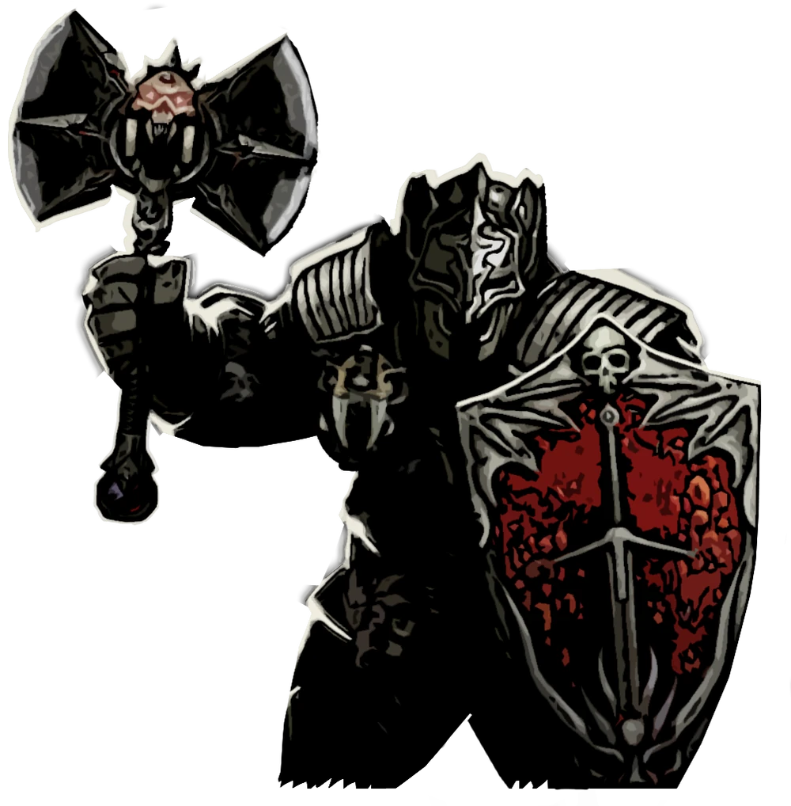

# The Hamlet Roster

> Modded Darkest Dungeon Heroes

---

 <!-- Beastmaster Card -->
  <a href="./Beastmaster.md" style="text-decoration: none; color: inherit;">
    

      
      

        

          Beastmaster
        

        

          Bleed / Stealth / Summoner
        

        

          “Civilized men condemn the beast for its savagery, never realizing that the forest has long judged us the crueler species.”
        

      

    

  </a>

  <!-- Falconer Card -->
  <a href="./Falconer.md" style="text-decoration: none; color: inherit;">
    

      
      

        

          Falconer
        

        

          Bleed / Mark / Range
        

        

          “Predators require neither malice nor hatred. Their mistress, regrettably, possesses both.”
        

      

    

  </a>

  <!-- Revenant Card -->
  <a href="./Revenant.md" style="text-decoration: none; color: inherit;">
    

      
      

        

          Revenant
        

        

          Bleed / Frontline / Tank
        

        

          “Death is said to be the great equalizer. Yet even it has become unreliable in these parts.”
        

      

    

  </a>

