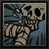
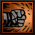
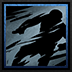
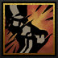
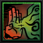
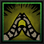
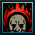
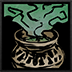
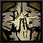
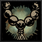

---
cssclasses:
  - wide-page
title: Monk
tags:
  - outsiders-bonfire
  - melee
  - healer
  - mobile
  - support
  - frontline
---
# Monk

<!-- MAIN LEFT COLUMN: BIO & DESCRIPTION -->

    
"Through years of enlightened discipline, his body has been forged into a weapon; his spirit a sanctuary. If either will withstand is yet known."

    
— The Ancestor

### Class Description
The **Monk** is a disciplined martial artist who channels the flow of Ki to empower both himself and his companions. Through fluid movement, devastating unarmed strikes, and selfless sacrifice, he balances offense and support while remaining steadfast in the face of adversity.

<!-- WIKI RIGHT COLUMN: INFOBOX -->

    
MONK

    

        
    

    <table style="width: 100%; margin: 0; border-collapse: collapse; font-size: 0.95em; clear: both; line-height: 1.3;">
        <tr style="border-bottom: 1px solid var(--background-modifier-border);">
            <td style="padding: 6px 0; vertical-align: middle;"><b>Movement</b></td>
            <td style="text-align: right; padding: 6px 0; vertical-align: middle;">3 Fwd, 1 Back</td>
        </tr>
        <tr style="border-bottom: 1px solid var(--background-modifier-border);">
            <td style="padding: 10px 0 6px 0; vertical-align: top;"><b>Crit Buff</b></td>
            <td style="text-align: right; padding: 10px 0 6px 0; vertical-align: top;">
                

                    Self: +10 DODGE 
                    Party: Heal 4% HP
                

            </td>
        </tr>
        <tr style="border-bottom: 1px solid var(--background-modifier-border);">
            <td style="padding: 6px 0; vertical-align: middle;"><b>Religious</b></td>
            <td style="text-align: right; padding: 6px 0; vertical-align: middle;">Yes</td>
        </tr>
        <tr>
            <td style="padding: 6px 0; vertical-align: middle;"><b>Provisions</b></td>
            <td style="text-align: right; padding: 6px 0; vertical-align: middle;">None</td>
        </tr>
    </table>

---

## Base Stats

<table style="width: 100%; border-collapse: collapse; background-color: #242424; margin-top: 10px; margin-bottom: 24px;">
    <tr style="background-color: #1a1a1a; color: #bfa67a; font-weight: bold; border-bottom: 1px solid #383830;">
        <th style="padding: 8px; text-align: left; width: 40%;">Attribute</th>
        <th style="padding: 8px; text-align: center; width: 30%;">Resolve 1</th>
        <th style="padding: 8px; text-align: center; width: 30%;">Resolve 5</th>
    </tr>
    <tr style="border-bottom: 1px solid #383830;">
        <td style="padding: 8px; vertical-align: middle; color: #e2d6b5; font-weight: bold;">MAX HP</td>
        <td style="padding: 8px; text-align: center; vertical-align: middle; color: #e2d6b5;">19</td>
        <td style="padding: 8px; text-align: center; vertical-align: middle; color: #e2d6b5;">35</td>
    </tr>
    <tr style="border-bottom: 1px solid #383830;">
        <td style="padding: 8px; vertical-align: middle; color: #e2d6b5; font-weight: bold;">DODGE</td>
        <td style="padding: 8px; text-align: center; vertical-align: middle; color: #e2d6b5;">10</td>
        <td style="padding: 8px; text-align: center; vertical-align: middle; color: #e2d6b5;">30</td>
    </tr>
    <tr style="border-bottom: 1px solid #383830;">
        <td style="padding: 8px; vertical-align: middle; color: #e2d6b5; font-weight: bold;">PROT</td>
        <td style="padding: 8px; text-align: center; vertical-align: middle; color: #e2d6b5;">0.1%</td>
        <td style="padding: 8px; text-align: center; vertical-align: middle; color: #e2d6b5;">0.1%</td>
    </tr>
    <tr style="border-bottom: 1px solid #383830;">
        <td style="padding: 8px; vertical-align: middle; color: #e2d6b5; font-weight: bold;">SPD</td>
        <td style="padding: 8px; text-align: center; vertical-align: middle; color: #e2d6b5;">7</td>
        <td style="padding: 8px; text-align: center; vertical-align: middle; color: #e2d6b5;">9</td>
    </tr>
    <tr style="border-bottom: 1px solid #383830;">
        <td style="padding: 8px; vertical-align: middle; color: #e2d6b5; font-weight: bold;">ACC MOD</td>
        <td style="padding: 8px; text-align: center; vertical-align: middle; color: #e2d6b5;">0</td>
        <td style="padding: 8px; text-align: center; vertical-align: middle; color: #e2d6b5;">0</td>
    </tr>
    <tr style="border-bottom: 1px solid #383830;">
        <td style="padding: 8px; vertical-align: middle; color: #e2d6b5; font-weight: bold;">CRIT</td>
        <td style="padding: 8px; text-align: center; vertical-align: middle; color: #e2d6b5;">0%</td>
        <td style="padding: 8px; text-align: center; vertical-align: middle; color: #e2d6b5;">4%</td>
    </tr>
    <tr>
        <td style="padding: 8px; vertical-align: middle; color: #e2d6b5; font-weight: bold;">DMG</td>
        <td style="padding: 8px; text-align: center; vertical-align: middle; color: #e2d6b5;">4 - 10</td>
        <td style="padding: 8px; text-align: center; vertical-align: middle; color: #e2d6b5;">8 - 14</td>
    </tr>
</table>

### Resistances

<table style="width: 100%; border-collapse: collapse; background-color: #242424; margin-top: 10px;">
    <tr style="background-color: #1a1a1a; color: #bfa67a; font-weight: bold; border-bottom: 1px solid #383830;">
        <th style="padding: 8px; text-align: left; width: 35%;">Type</th>
        <th style="padding: 8px; text-align: center; width: 15%;">Base %</th>
        <th style="padding: 8px; text-align: left; width: 35%;">Type</th>
        <th style="padding: 8px; text-align: center; width: 15%;">Base %</th>
    </tr>
    <tr style="border-bottom: 1px solid #383830;">
        <td style="padding: 8px; vertical-align: middle; color: #e2d6b5;">
             Stun
        </td>
        <td style="padding: 8px; text-align: center; vertical-align: middle; color: #e2d6b5;">30%</td>
        <td style="padding: 8px; vertical-align: middle; color: #e2d6b5;">
             Bleed
        </td>
        <td style="padding: 8px; text-align: center; vertical-align: middle; color: #e2d6b5;">20%</td>
    </tr>
    <tr style="border-bottom: 1px solid #383830;">
        <td style="padding: 8px; vertical-align: middle; color: #e2d6b5;">
             Move
        </td>
        <td style="padding: 8px; text-align: center; vertical-align: middle; color: #e2d6b5;">30%</td>
        <td style="padding: 8px; vertical-align: middle; color: #e2d6b5;">
             Disease
        </td>
        <td style="padding: 8px; text-align: center; vertical-align: middle; color: #e2d6b5;">40%</td>
    </tr>
    <tr style="border-bottom: 1px solid #383830;">
        <td style="padding: 8px; vertical-align: middle; color: #e2d6b5;">
             Blight
        </td>
        <td style="padding: 8px; text-align: center; vertical-align: middle; color: #e2d6b5;">40%</td>
        <td style="padding: 8px; vertical-align: middle; color: #e2d6b5;">
             Debuff
        </td>
        <td style="padding: 8px; text-align: center; vertical-align: middle; color: #e2d6b5;">40%</td>
    </tr>
    <tr>
        <td style="padding: 8px; vertical-align: middle; color: #e2d6b5;">
             Death Blow
        </td>
        <td style="padding: 8px; text-align: center; vertical-align: middle; color: #e2d6b5;">67%</td>
        <td style="padding: 8px; vertical-align: middle; color: #e2d6b5;">
             Trap Disarm
        </td>
        <td style="padding: 8px; text-align: center; vertical-align: middle; color: #e2d6b5;">20%</td>
    </tr>
</table>

---

## Combat Skills Overview

The Monk's combat skills blend agile martial arts with restorative techniques fueled by Ki. He flows across the battlefield with powerful strikes, stunning and repositioning enemies while healing, protecting, and inspiring allies at the cost of his own vitality.

---

## Move List

    

        

            
            Dragon Tail
        

        Melee
    

    <table style="width: 100%; border-collapse: collapse; margin: 0; font-size: 0.9em; background-color: #242424;">
        <thead>
            <tr style="background-color: #1a1a1a; color: #bfa67a; font-weight: bold; border-bottom: 1px solid #383830;">
                <th style="padding: 8px; text-align: center; width: 15%;">Rank</th>
                <th style="padding: 8px; text-align: center; width: 15%;">Target</th>
                <th style="padding: 8px; text-align: center; width: 10%;">Damage</th>
                <th style="padding: 8px; text-align: center; width: 10%;">Accuracy</th>
                <th style="padding: 8px; text-align: center; width: 10%;">Crit Mod</th>
                <th style="padding: 8px; text-align: left; width: 15%;">Effect</th>
                <th style="padding: 8px; text-align: left; width: 25%;">Self</th>
            </tr>
        </thead>
        <tbody>
            <tr style="border-bottom: 1px solid #383830; text-align: center;">
                <td style="padding: 10px; font-size: 1.2em; letter-spacing: 2px; vertical-align: middle;">x ● ● ●</td>
                <td style="padding: 10px; font-size: 1.2em; letter-spacing: 2px; vertical-align: middle;">● ● ● x</td>
                <td style="padding: 10px; vertical-align: middle;">-</td>
                <td style="padding: 10px; vertical-align: middle;">95</td>
                <td style="padding: 10px; vertical-align: middle;">+6.0%</td>
                <td style="padding: 10px; text-align: left; vertical-align: middle;">-</td>
                <td style="padding: 10px; text-align: left; line-height: 1.4; vertical-align: middle;">
                    Forward 1 
                    Buff Self: +10 CRIT Except for Dragon Tail
                </td>
            </tr>
        </tbody>
    </table>

---

    

        

            
            Howling Fist
        

        Melee
    

    <table style="width: 100%; border-collapse: collapse; margin: 0; font-size: 0.9em; background-color: #242424;">
        <thead>
            <tr style="background-color: #1a1a1a; color: #bfa67a; font-weight: bold; border-bottom: 1px solid #383830;">
                <th style="padding: 8px; text-align: center; width: 15%;">Rank</th>
                <th style="padding: 8px; text-align: center; width: 15%;">Target</th>
                <th style="padding: 8px; text-align: center; width: 10%;">Damage</th>
                <th style="padding: 8px; text-align: center; width: 10%;">Accuracy</th>
                <th style="padding: 8px; text-align: center; width: 10%;">Crit Mod</th>
                <th style="padding: 8px; text-align: left; width: 15%;">Effect</th>
                <th style="padding: 8px; text-align: left; width: 25%;">Self</th>
            </tr>
        </thead>
        <tbody>
            <tr style="border-bottom: 1px solid #383830; text-align: center;">
                <td style="padding: 10px; font-size: 1.2em; letter-spacing: 2px; vertical-align: middle;">x x ● ●</td>
                <td style="padding: 10px; font-size: 1.2em; letter-spacing: 2px; vertical-align: middle;">● ● x x</td>
                <td style="padding: 10px; vertical-align: middle;">-20%</td>
                <td style="padding: 10px; vertical-align: middle;">100</td>
                <td style="padding: 10px; vertical-align: middle;">+10.0%</td>
                <td style="padding: 10px; text-align: left; vertical-align: middle;">Debuff Target: -20 PROT (110% Base)</td>
                <td style="padding: 10px; text-align: left; line-height: 1.4; vertical-align: middle;">
                    Back 1 When Used in 1st Position: Heal HP With Mantram: Heals the Additional HP Regardless of Position 
                    Buff Self: +25% DMG Except for Howling Fist
                </td>
            </tr>
        </tbody>
    </table>

---

    

        

            
            Iron Mountain
        

        Melee
    

    <table style="width: 100%; border-collapse: collapse; margin: 0; font-size: 0.9em; background-color: #242424;">
        <thead>
            <tr style="background-color: #1a1a1a; color: #bfa67a; font-weight: bold; border-bottom: 1px solid #383830;">
                <th style="padding: 8px; text-align: center; width: 15%;">Rank</th>
                <th style="padding: 8px; text-align: center; width: 15%;">Target</th>
                <th style="padding: 8px; text-align: center; width: 10%;">Damage</th>
                <th style="padding: 8px; text-align: center; width: 10%;">Accuracy</th>
                <th style="padding: 8px; text-align: center; width: 10%;">Crit Mod</th>
                <th style="padding: 8px; text-align: left; width: 15%;">Effect</th>
                <th style="padding: 8px; text-align: left; width: 25%;">Self</th>
            </tr>
        </thead>
        <tbody>
            <tr style="border-bottom: 1px solid #383830; text-align: center;;">
                <td style="padding: 10px; font-size: 1.2em; letter-spacing: 2px; vertical-align: middle;">x ● ● x</td>
                <td style="padding: 10px; font-size: 1.2em; letter-spacing: 2px; vertical-align: middle;">●-● x x</td>
                <td style="padding: 10px; vertical-align: middle;">-40%</td>
                <td style="padding: 10px; vertical-align: middle;">90</td>
                <td style="padding: 10px; vertical-align: middle;">-2.0%</td>
                <!-- EFFECT COLUMN FIX -->
                <td style="padding: 10px; text-align: left; vertical-align: middle;">
                    

                        Armor Piercing 
                        Knockback 3 (110% Base) 
                        Enemy Party: Clear Corpses
                    

                </td>
                <!-- SELF COLUMN -->
                <td style="padding: 10px; text-align: left; vertical-align: middle;">
                    

                        Forward 2 
                        -20 DODGE / -10 PROT
                    

                </td>
            </tr>
        </tbody>
    </table>

---

    

        

            
            Sweeping Kick
        

        Melee
    

    <table style="width: 100%; border-collapse: collapse; margin: 0; font-size: 0.9em; background-color: #242424;">
        <thead>
            <tr style="background-color: #1a1a1a; color: #bfa67a; font-weight: bold; border-bottom: 1px solid #383830;">
                <th style="padding: 8px; text-align: center; width: 15%;">Rank</th>
                <th style="padding: 8px; text-align: center; width: 15%;">Target</th>
                <th style="padding: 8px; text-align: center; width: 10%;">Damage</th>
                <th style="padding: 8px; text-align: center; width: 10%;">Accuracy</th>
                <th style="padding: 8px; text-align: center; width: 10%;">Crit Mod</th>
                <th style="padding: 8px; text-align: left; width: 15%;">Effect</th>
                <th style="padding: 8px; text-align: left; width: 25%;">Self</th>
            </tr>
        </thead>
        <tbody>
            <tr style="border-bottom: 1px solid #383830; text-align: center;">
                <td style="padding: 10px; font-size: 1.2em; letter-spacing: 2px; vertical-align: middle;">x x ● ●</td>
                <td style="padding: 10px; font-size: 1.2em; letter-spacing: 2px; vertical-align: middle;">● ● x x</td>
                <td style="padding: 10px; vertical-align: middle;">-50%</td>
                <td style="padding: 10px; vertical-align: middle;">90</td>
                <td style="padding: 10px; vertical-align: middle;">+3.0%</td>
                <!-- WRAPPED EFFECT TEXT WITH LINE HEIGHT REINFORCEMENT -->
                <td style="padding: 10px; text-align: left; vertical-align: middle;">
                    

                        Stun (100 Base) 
                        Debuff Target: -5 SPD (100% Base)
                    

                </td>
                <td style="padding: 10px; text-align: left; line-height: 1.4; vertical-align: middle;">
                    Buff Self: +15% DMG Except for Sweeping Kick / +7 CRIT Except for Sweeping Kick
                </td>
            </tr>
        </tbody>
    </table>

---

    

        

            
            Transfer
        

        Heal
    

    <table style="width: 100%; border-collapse: collapse; margin: 0; font-size: 0.9em; background-color: #242424;">
        <thead>
            <tr style="background-color: #1a1a1a; color: #bfa67a; font-weight: bold; border-bottom: 1px solid #383830;">
                <th style="padding: 8px; text-align: center; width: 25%;">Rank Valid Above 25% HP</th>
                <th style="padding: 8px; text-align: center; width: 25%;">Target</th>
                <th style="padding: 8px; text-align: left; width: 50%;">Effect</th>
                <th style="padding: 8px; text-align: left; width: 50%;">Self</th>
            </tr>
        </thead>
        <tbody>
            <tr style="border-bottom: 1px solid #383830;">
                <td style="padding: 10px; text-align: center; font-size: 1.2em; letter-spacing: 2px; vertical-align: middle;">
                    ● ● ● ●
                </td>
                <td style="padding: 10px; text-align: center; font-size: 1.2em; letter-spacing: 2px; vertical-align: middle;">
                    ● ● ● ●
                </td>
                <td style="padding: 10px; text-align: left; line-height: 1.5; vertical-align: middle;">
                    Heal 1-1 Heal 20% HP (Effects Don't Apply to Self)
                </td>
                <td style="padding: 10px; text-align: left; line-height: 1.5; vertical-align: middle;">
                    Suffer 5 DMG / -10 DODGE / -10 PROT
                </td>
            </tr>
        </tbody>
    </table>

---

    

        

            
            Mantram
        

        Heal
    

    <table style="width: 100%; border-collapse: collapse; margin: 0; font-size: 0.9em; background-color: #242424;">
        <thead>
            <tr style="background-color: #1a1a1a; color: #bfa67a; font-weight: bold; border-bottom: 1px solid #383830;">
                <th style="padding: 8px; text-align: center; width: 25%;">Rank</th>
                <th style="padding: 8px; text-align: left; width: 50%;">Effect</th>
                <th style="padding: 8px; text-align: left; width: 50%;">Self</th>
            </tr>
        </thead>
        <tbody>
            <tr style="border-bottom: 1px solid #383830;">
                <td style="padding: 10px; text-align: center; font-size: 1.2em; letter-spacing: 2px; vertical-align: middle;">
                    x ● ● ●
                </td>
                <td style="padding: 10px; text-align: left; line-height: 1.5; vertical-align: middle;">
                    Heal Party 1-2 / +20 PROT
                </td>
                <td style="padding: 10px; text-align: left; line-height: 1.5; vertical-align: middle;">
                    Howling Fist: +1 Healing Done -10 DODGE / -10 PROT / -100% Stress Relief Received +100 CRIT / -40% DMG Except for Riposte
                </td>
            </tr>
        </tbody>
    </table>

---

    

        

            
            Inner Fire
        

        Buff
    

    <table style="width: 100%; border-collapse: collapse; margin: 0; font-size: 0.9em; background-color: #242424;">
        <thead>
            <tr style="background-color: #1a1a1a; color: #bfa67a; font-weight: bold; border-bottom: 1px solid #383830;">
                <th style="padding: 8px; text-align: center; width: 20%;">Rank</th>
                <th style="padding: 8px; text-align: center; width: 20%;">Effect</th>
                <th style="padding: 8px; text-align: left; width: 60%;">Self</th>
            </tr>
        </thead>
        <tbody>
            <tr style="border-bottom: 1px solid #383830; text-align: center;">
                <td style="padding: 10px; font-size: 1.2em; letter-spacing: 2px; vertical-align: middle;">
                    ● ● ● ●
                </td>
                <td style="padding: 10px; vertical-align: middle;">-</td>
                <!-- SELF COLUMN FIX -->
                <td style="padding: 10px; text-align: left; vertical-align: middle;">
                    

                        Heal 0-4 
                        Stress: -5 (67% Chance) 
                        Activates Riposte 
                        Buff Self: +15% DMG Except for Riposte / +10% DMG 
                        Debuff Self: Riposte: -40% DMG / -10 CRIT
                    

                </td>
            </tr>
        </tbody>
    </table>

---

## Camping Skills

The Monk's camping skills reflect years of meditation, spiritual discipline, and holistic healing. Through guidance, acupressure, and traditional remedies, he relieves stress, cures disease, and restores the party's strength before the next battle.

    

        

            
            Cleanse
        

        Cost: 4 Time
    

    <table style="width: 100%; border-collapse: collapse; margin: 0; font-size: 0.9em; background-color: #242424;">
        <tr style="background-color: #1a1a1a; color: #bfa67a; font-weight: bold; border-bottom: 1px solid #383830;">
            <th style="padding: 8px; text-align: left; width: 25%;">Target</th>
            <th style="padding: 8px; text-align: left; width: 75%;">Effects</th>
        </tr>
        <tr>
            <td style="padding: 12px; color: #e2d6b5; vertical-align: top; border-right: 1px solid #383830; font-weight: bold;">
                One Companion
            </td>
            <td style="padding: 12px; color: #e2d6b5; vertical-align: top; line-height: 1.4;">
                Heal 15% HP Cure Blight Cure Disease Remove Mortality Debuffs
            </td>
        </tr>
    </table>

---

    

        

            
            Acupressure
        

        Cost: 3 Time
    

    <table style="width: 100%; border-collapse: collapse; margin: 0; font-size: 0.9em; background-color: #242424;">
        <tr style="background-color: #1a1a1a; color: #bfa67a; font-weight: bold; border-bottom: 1px solid #383830;">
            <th style="padding: 8px; text-align: left; width: 25%;">Target</th>
            <th style="padding: 8px; text-align: left; width: 75%;">Effects</th>
        </tr>
        <tr>
            <td style="padding: 12px; color: #e2d6b5; vertical-align: top; border-right: 1px solid #383830; font-weight: bold;">
                One Companion
            </td>
            <td style="padding: 12px; color: #e2d6b5; vertical-align: top; line-height: 1.4;">
                +4 SPD +10 DODGE
            </td>
        </tr>
    </table>

---

    

        

            
            Tranquility
        

        Cost: 4 Time
    

    <table style="width: 100%; border-collapse: collapse; margin: 0; font-size: 0.9em; background-color: #242424;">
        <tr style="background-color: #1a1a1a; color: #bfa67a; font-weight: bold; border-bottom: 1px solid #383830;">
            <th style="padding: 8px; text-align: left; width: 25%;">Target</th>
            <th style="padding: 8px; text-align: left; width: 75%;">Effects</th>
        </tr>
        <tr>
            <td style="padding: 12px; color: #e2d6b5; vertical-align: top; border-right: 1px solid #383830; font-weight: bold;">
                Self Only
            </td>
            <td style="padding: 12px; color: #e2d6b5; vertical-align: top; line-height: 1.4;">
                Stress: -20 -20% Stress Received  Remove Mortality Debuffs
            </td>
        </tr>
    </table>

---

    

        

            
            Conviction Mantra
        

        Cost: 4 Time
    

    <table style="width: 100%; border-collapse: collapse; margin: 0; font-size: 0.9em; background-color: #242424;">
        <tr style="background-color: #1a1a1a; color: #bfa67a; font-weight: bold; border-bottom: 1px solid #383830;">
            <th style="padding: 8px; text-align: left; width: 25%;">Target</th>
            <th style="padding: 8px; text-align: left; width: 75%;">Effects</th>
        </tr>
        <tr>
            <td style="padding: 12px; color: #e2d6b5; vertical-align: top; border-right: 1px solid #383830; font-weight: bold;">
                Party
            </td>
            <td style="padding: 12px; color: #e2d6b5; vertical-align: top; line-height: 1.4;">
                +15% DMG (4 Battles) (50% Chance) +7 CRIT (4 Battles) (50% Chance) -15% Stress Received
            </td>
        </tr>
    </table>

---

## Equipment

The monk practices an unarmed combat style that relies on neither heavy armor nor weapons to be effective, preferring light equipment that minimizes the burden on his movements. His body, tempered through years of rigorous training, serves as both a deadly weapon and a conduit through which Ki flows to aid his companions.

