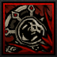
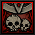
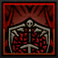
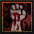
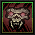
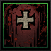
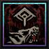

---
cssclasses:
  - wide-page
title: Revenant
tags:
  - bleed
  - frontline
  - tank
  - summoner
---
# Revenant

<!-- MAIN LEFT COLUMN: BIO & DESCRIPTION -->

    
"Death is said to be the great equalizer. Yet even it has become unreliable."

    
— The Ancestor

### Class Description
The **Revenant** is an undead warrior driven by unfinished purpose. They excel at enduring overwhelming punishment. His abilities reward fighting at Death's Door, allowing him to shield allies and retaliate with relentless determination.

<!-- WIKI RIGHT COLUMN: INFOBOX -->

    
REVENANT

    
  
  

    <table style="width: 100%; margin: 0; border-collapse: collapse; font-size: 0.95em; clear: both;">
        <tr style="border-bottom: 1px solid var(--background-modifier-border);"><td style="padding: 6px 0;"><b>Movement</b></td><td style="text-align: right; padding: 6px 0;">1 Fwd, 1 Back</td></tr>
        <tr style="border-bottom: 1px solid var(--background-modifier-border);"><td style="padding: 6px 0;"><b>Crit Buff</b></td><td style="text-align: right; padding: 6px 0; color: #ffbc42;">Bleed Chance</td></tr>
        <tr style="border-bottom: 1px solid var(--background-modifier-border);"><td style="padding: 6px 0;"><b>Religious</b></td><td style="text-align: right; padding: 6px 0;">No</td></tr>
        <tr><td style="padding: 6px 0;"><b>Provisions</b></td><td style="text-align: right; padding: 6px 0;">Skeleton Key</td></tr>
    </table>

## Base Stats

<table style="width: 100%; border-collapse: collapse; background-color: #242424; margin-top: 10px; margin-bottom: 24px;">
    <tr style="background-color: #1a1a1a; color: #bfa67a; font-weight: bold; border-bottom: 1px solid #383830;">
        <th style="padding: 8px; text-align: left; width: 40%;">Attribute</th>
        <th style="padding: 8px; text-align: center; width: 30%;">Resolve 1</th>
        <th style="padding: 8px; text-align: center; width: 30%;">Resolve 5</th>
    </tr>
    <tr style="border-bottom: 1px solid #383830;">
        <td style="padding: 8px; vertical-align: middle; color: #e2d6b5; font-weight: bold;">MAX HP</td>
        <td style="padding: 8px; text-align: center; vertical-align: middle; color: #e2d6b5;">32</td>
        <td style="padding: 8px; text-align: center; vertical-align: middle; color: #e2d6b5;">60</td>
    </tr>
    <tr style="border-bottom: 1px solid #383830;">
        <td style="padding: 8px; vertical-align: middle; color: #e2d6b5; font-weight: bold;">DODGE</td>
        <td style="padding: 8px; text-align: center; vertical-align: middle; color: #e2d6b5;">0</td>
        <td style="padding: 8px; text-align: center; vertical-align: middle; color: #e2d6b5;">20</td>
    </tr>
    <tr style="border-bottom: 1px solid #383830;">
        <td style="padding: 8px; vertical-align: middle; color: #e2d6b5; font-weight: bold;">PROT</td>
        <td style="padding: 8px; text-align: center; vertical-align: middle; color: #e2d6b5;">0%</td>
        <td style="padding: 8px; text-align: center; vertical-align: middle; color: #e2d6b5;">0%</td>
    </tr>
    <tr style="border-bottom: 1px solid #383830;">
        <td style="padding: 8px; vertical-align: middle; color: #e2d6b5; font-weight: bold;">SPD</td>
        <td style="padding: 8px; text-align: center; vertical-align: middle; color: #e2d6b5;">0</td>
        <td style="padding: 8px; text-align: center; vertical-align: middle; color: #e2d6b5;">0</td>
    </tr>
    <tr style="border-bottom: 1px solid #383830;">
        <td style="padding: 8px; vertical-align: middle; color: #e2d6b5; font-weight: bold;">ACC MOD</td>
        <td style="padding: 8px; text-align: center; vertical-align: middle; color: #e2d6b5;">0</td>
        <td style="padding: 8px; text-align: center; vertical-align: middle; color: #e2d6b5;">0</td>
    </tr>
    <tr style="border-bottom: 1px solid #383830;">
        <td style="padding: 8px; vertical-align: middle; color: #e2d6b5; font-weight: bold;">CRIT</td>
        <td style="padding: 8px; text-align: center; vertical-align: middle; color: #e2d6b5;">2%</td>
        <td style="padding: 8px; text-align: center; vertical-align: middle; color: #e2d6b5;">4%</td>
    </tr>
    <tr>
        <td style="padding: 8px; vertical-align: middle; color: #e2d6b5; font-weight: bold;">DMG</td>
        <td style="padding: 8px; text-align: center; vertical-align: middle; color: #e2d6b5;">5 - 7</td>
        <td style="padding: 8px; text-align: center; vertical-align: middle; color: #e2d6b5;">9 - 12</td>
    </tr>
</table>

 

### Resistances

<table style="width: 100%; border-collapse: collapse; background-color: #242424; margin-top: 10px;">
    <tr style="background-color: #1a1a1a; color: #bfa67a; font-weight: bold; border-bottom: 1px solid #383830;">
        <th style="padding: 8px; text-align: left; width: 35%;">Type</th>
        <th style="padding: 8px; text-align: center; width: 15%;">Base %</th>
        <th style="padding: 8px; text-align: left; width: 35%;">Type</th>
        <th style="padding: 8px; text-align: center; width: 15%;">Base %</th>
    </tr>
    <tr style="border-bottom: 1px solid #383830;">
        <td style="padding: 8px; vertical-align: middle; color: #e2d6b5;">
             Stun
        </td>
        <td style="padding: 8px; text-align: center; vertical-align: middle; color: #e2d6b5;">40%</td>
        <td style="padding: 8px; vertical-align: middle; color: #e2d6b5;">
             Bleed
        </td>
        <td style="padding: 8px; text-align: center; vertical-align: middle; color: #e2d6b5;">40%</td>
    </tr>
    <tr style="border-bottom: 1px solid #383830;">
        <td style="padding: 8px; vertical-align: middle; color: #e2d6b5;">
             Move
        </td>
        <td style="padding: 8px; text-align: center; vertical-align: middle; color: #e2d6b5;">60%</td>
        <td style="padding: 8px; vertical-align: middle; color: #e2d6b5;">
             Disease
        </td>
        <td style="padding: 8px; text-align: center; vertical-align: middle; color: #e2d6b5;">40%</td>
    </tr>
    <tr style="border-bottom: 1px solid #383830;">
        <td style="padding: 8px; vertical-align: middle; color: #e2d6b5;">
             Blight
        </td>
        <td style="padding: 8px; text-align: center; vertical-align: middle; color: #e2d6b5;">40%</td>
        <td style="padding: 8px; vertical-align: middle; color: #e2d6b5;">
             Debuff
        </td>
        <td style="padding: 8px; text-align: center; vertical-align: middle; color: #e2d6b5;">10%</td>
    </tr>
    <tr>
        <td style="padding: 8px; vertical-align: middle; color: #e2d6b5;">
             Death Blow
        </td>
        <td style="padding: 8px; text-align: center; vertical-align: middle; color: #e2d6b5;">67%</td>
        <td style="padding: 8px; vertical-align: middle; color: #e2d6b5;">
             Trap Disarm
        </td>
        <td style="padding: 8px; text-align: center; vertical-align: middle; color: #e2d6b5;">10%</td>
    </tr>
</table>

## Combat Skills Overview

Dark and corrupted, the Revenant is a sanguine knight with unmatched durability. As a master of the dark arts, he saps the blood of his adversaries at a cost, weakens them and empowers himself as his enemies bleed. He strives to preserve order through chaos and destruction.

### Move List

<!-- COMBAT TYPE SKILL (RED) -->

    

        

            
            Obliterate
        

        Melee
    

    <table style="width: 100%; border-collapse: collapse; margin: 0; font-size: 0.9em; background-color: #242424;">
        <tr style="background-color: #1a1a1a; color: #bfa67a; font-weight: bold; border-bottom: 1px solid #383830;">
            <th style="padding: 8px; text-align: center;">Rank</th>
            <th style="padding: 8px; text-align: center;">Target</th>
            <th style="padding: 8px; text-align: center;">Damage</th>
            <th style="padding: 8px; text-align: center;">Accuracy</th>
            <th style="padding: 8px; text-align: center;">Crit Mod</th>
            <th style="padding: 8px; text-align: center;">Effect</th>
            <th style="padding: 8px; text-align: center;">Self</th>
        </tr>
        <tr style="border-bottom: 1px solid #383830; text-align: center;">
            <td style="padding: 10px; font-size: 1.2em; letter-spacing: 2px;">x x ● ●</td>
            <td style="padding: 10px; font-size: 1.2em; letter-spacing: 2px;">● ● x x</td>
            <td style="padding: 10px;">+0%</td>
            <td style="padding: 10px;">95</td>
            <td style="padding: 10px;">+2.0%</td>
            <td style="padding: 10px;">Bypass Guard   Knockback 1 (85% Base) +20 DMG vs Bleeding</td>
            <td style="padding: 10px;">-</td>
        </tr>
    </table>

***

<!-- COMBAT TYPE SKILL (RED) -->

    

        

            
            Sanguine Strike
        

        Melee
    

    <table style="width: 100%; border-collapse: collapse; margin: 0; font-size: 0.9em; background-color: #242424;">
        <tr style="background-color: #1a1a1a; color: #bfa67a; font-weight: bold; border-bottom: 1px solid #383830;">
            <th style="padding: 8px; text-align: center;">Rank</th>
            <th style="padding: 8px; text-align: center;">Target</th>
            <th style="padding: 8px; text-align: center;">Damage</th>
            <th style="padding: 8px; text-align: center;">Accuracy</th>
            <th style="padding: 8px; text-align: center;">Crit Mod</th>
            <th style="padding: 8px; text-align: center;">Effect</th>
            <th style="padding: 8px; text-align: center;">Self</th>
        </tr>
        <tr style="border-bottom: 1px solid #383830; text-align: center;">
            <td style="padding: 10px; font-size: 1.2em; letter-spacing: 2px;">x x ● ●</td>
            <td style="padding: 10px; font-size: 1.2em; letter-spacing: 2px;">●-● x x</td>
            <td style="padding: 10px;">-50%</td>
            <td style="padding: 10px;">85</td>
            <td style="padding: 10px;">-1.0%</td>
            <td style="padding: 10px;">Bleed (100% Base) 2pts/rd for 3rds   Debuff Target: +30% Bleed Duration Received (100% Base)</td>
            <td style="padding: 10px;">-</td>
        </tr>
    </table>

---

<!-- COMBAT TYPE SKILL (RED) -->

    

        

            
            Bloodfury
        

        Melee
    

    <table style="width: 100%; border-collapse: collapse; margin: 0; font-size: 0.9em; background-color: #242424;">
        <tr style="background-color: #1a1a1a; color: #bfa67a; font-weight: bold; border-bottom: 1px solid #383830;">
            <th style="padding: 8px; text-align: center;">Rank</th>
            <th style="padding: 8px; text-align: center;">Target</th>
            <th style="padding: 8px; text-align: center;">Damage</th>
            <th style="padding: 8px; text-align: center;">Accuracy</th>
            <th style="padding: 8px; text-align: center;">Crit Mod</th>
            <th style="padding: 8px; text-align: center;">Effect</th>
            <th style="padding: 8px; text-align: center;">Self</th>
        </tr>
        <tr style="border-bottom: 1px solid #383830; text-align: center;">
            <td style="padding: 10px; font-size: 1.2em; letter-spacing: 2px;">x x ● ●</td>
            <td style="padding: 10px; font-size: 1.2em; letter-spacing: 2px;">● ● x x</td>
            <td style="padding: 10px;">-50%</td>
            <td style="padding: 10px;">90</td>
            <td style="padding: 10px;">+1.0%</td>
            <td style="padding: 10px;"> Bleed (100% Base) 2 pts/rd for 3rds </td>
            <td style="padding: 10px;">Activates Riposte   Marks Target  Debuff Target: +30% Bleed Amount Received</td>
        </tr>
    </table>

---

<!-- COMBAT TYPE SKILL (RED) -->

    

        

            
            Crimson Unity
        

        Ranged
    

    <table style="width: 100%; border-collapse: collapse; margin: 0; font-size: 0.9em; background-color: #242424;">
        <tr style="background-color: #1a1a1a; color: #bfa67a; font-weight: bold; border-bottom: 1px solid #383830;">
            <th style="padding: 8px; text-align: center;">Rank</th>
            <th style="padding: 8px; text-align: center;">Target</th>
            <th style="padding: 8px; text-align: center;">Damage</th>
            <th style="padding: 8px; text-align: center;">Accuracy</th>
            <th style="padding: 8px; text-align: center;">Crit Mod</th>
            <th style="padding: 8px; text-align: center;">Effect</th>
            <th style="padding: 8px; text-align: center;">Self</th>
        </tr>
        <tr style="border-bottom: 1px solid #383830; text-align: center;">
            <td style="padding: 10px; font-size: 1.2em; letter-spacing: 2px;">● ● ● ●</td>
            <td style="padding: 10px; font-size: 1.2em; letter-spacing: 2px;">●  ● ●  ●</td>
            <td style="padding: 10px;">-90%</td>
            <td style="padding: 10px;">95</td>
            <td style="padding: 10px;">-</td>
            <td style="padding: 10px;">Bypass Guard   Transfer All Bleed to Target   Enemy Party: Clear Corpses   Debuff Target: +15% DMG Received (120% Base) </td>
            <td style="padding: 10px;">Blight (80% Base) 2pts/rd for 1/rds   Debuff Self: Disable Blighting Skills</td>
        </tr>
    </table>

---

<!-- COMBAT TYPE SKILL (RED) -->

    

        

            
            Siphon Life
        

        Ranged
    

    <table style="width: 100%; border-collapse: collapse; margin: 0; font-size: 0.9em; background-color: #242424;">
        <tr style="background-color: #1a1a1a; color: #bfa67a; font-weight: bold; border-bottom: 1px solid #383830;">
            <th style="padding: 8px; text-align: center;">Rank   Valid Below 33% HP</th>
            <th style="padding: 8px; text-align: center;">Target</th>
            <th style="padding: 8px; text-align: center;">Damage</th>
            <th style="padding: 8px; text-align: center;">Accuracy</th>
            <th style="padding: 8px; text-align: center;">Crit Mod</th>
            <th style="padding: 8px; text-align: center;">Effect</th>
            <th style="padding: 8px; text-align: center;">Self</th>
        </tr>
        <tr style="border-bottom: 1px solid #383830; text-align: center;">
            <td style="padding: 10px; font-size: 1.2em; letter-spacing: 2px;">● ● ● ●</td>
            <td style="padding: 10px; font-size: 1.2em; letter-spacing: 2px;">●-●-●-●</td>
            <td style="padding: 10px;">-75%</td>
            <td style="padding: 10px;">100</td>
            <td style="padding: 10px;">-</td>
            <td style="padding: 10px;">Bypass Guard   Enemy Party: Clear Enemy Corpses </td>
            <td style="padding: 10px;">Heal 3% HP Blight (80% Base) 2pts/rd for 1/rds  Debuff Self: Disable Blighting Skills</td>
        </tr>
    </table>

---

<!-- HEAL/SUPPORT TYPE SKILL (GREEN) -->

    

        

            
            Vampiric Embrace
        

        Ranged
    

    <table style="width: 100%; border-collapse: collapse; margin: 0; font-size: 0.9em; background-color: #242424;">
        <tr style="background-color: #1a1a1a; color: #bfa67a; font-weight: bold; border-bottom: 1px solid #383830;">
            <th style="padding: 8px; text-align: center;">Rank</th>
            <th style="padding: 8px; text-align: center;">Target</th>
            <th style="padding: 8px; text-align: center;">Effect</th>
            <th style="padding: 8px; text-align: center;">Self</th>
        </tr>
        <tr style="border-bottom: 1px solid #383830; text-align: center;">
            <td style="padding: 10px; font-size: 1.2em; letter-spacing: 2px;">x x ● ●</td>
            <td style="padding: 10px; font-size: 1.2em; letter-spacing: 2px;">● ● ● ●</td>
            <td style="padding: 10px;">Heal 4-5   Stress: +4   Buff Target: +15% Healing Received / -15% Stress</td>
            <td style="padding: 10px;">Suffer 9 DMG</td>
        </tr>
    </table>

---

<!-- BUFF/DEFENSE TYPE SKILL (BLUE) -->

    

        

            
            Necromancy
        

        Buff
    

    <table style="width: 100%; border-collapse: collapse; margin: 0; font-size: 0.9em; background-color: #242424;">
    <tr style="background-color: #1a1a1a; color: #bfa67a; font-weight: bold; border-bottom: 1px solid #383830;">
            <th style="padding: 8px; text-align: center;">Rank</th>
            <th style="padding: 8px; text-align: center;">Effect</th>
            <th style="padding: 8px; text-align: center;">Self</th>
        </tr>
        <tr style="border-bottom: 1px solid #383830; text-align: center;">
            <td style="padding: 10px; font-size: 1.2em; letter-spacing: 2px;">● ● ● ●</td>
            <td style="padding: 10px;">Allies: Stress +4   Debuff Enemies: Reanimate a necrotic hound to fight for you (2rds). Requires one empty space on the enemy side.</td>
            <td style="padding: 10px;">1 Blocks   Buff Self: -20% DMG Received</td>
        </tr>
    </table>

---

## Camping Skills

Revenant is a blood knight from the ancient age. Despised by many for a very good reason, he weakens his group to strengthen himself however, we need all the help we can get in these dire times.

---

## Equipment

The Revenant is nothing without his reaver, his shield, and his heavy armor. All of his gear is imbued with powerful dark magic - some even say it's possessed. His unbreakable shield bleeds his enemies, and his bloodthirsty reaver breaks them.

---

## Trivia 
* The Revenant was heavily inspired by Dragon Age, Warcraft and Darkness the video game. 
* The Revenant utilizes the same skel and atlas files as the Man-at-Arms. 
* The Revenant uses the Crimson Shrine district.