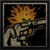
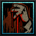
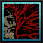
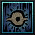
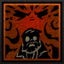
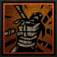
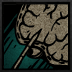
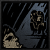
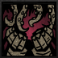
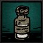

---
cssclasses:
  - wide-page
title: Therapist
tags:
  - backline
  - athenaeum
  - support
  - stress-healer
---
# Therapist

<!-- MAIN LEFT COLUMN: BIO & DESCRIPTION -->

    
"Hail, the Vessel of your deliverance."

    
— The Ancestor

### Class Description
A herd of sheep needs its shepherd. Then, with a lion leading the herd, those meek and docile sheep can defeat even the most ferocious of the animals. However, do not expect the beast to attend to the pure in heart forever. Slowly, the beast shall conspire with the most evil of the plot. The one to lead all the thankful into its own maw. Only then it will extend its claws.

<!-- WIKI RIGHT COLUMN: INFOBOX -->

    
THERAPIST

    

    

    <table style="width: 100%; margin: 0; border-collapse: collapse; font-size: 0.95em; clear: both;">
        <tr style="border-bottom: 1px solid var(--background-modifier-border);"><td style="padding: 6px 0;"><b>Movement</b></td><td style="text-align: right; padding: 6px 0;">0 Fwd, 2 Back</td></tr>
        <tr style="border-bottom: 1px solid var(--background-modifier-border);"><td style="padding: 6px 0;"><b>Crit Buff</b></td><td style="text-align: right; padding: 6px 0; color: #ffbc42;">Enemy Party: -10 DODGE (150% Base) (3 rds)</td></tr>
        <tr style="border-bottom: 1px solid var(--background-modifier-border);"><td style="padding: 6px 0;"><b>Religious</b></td><td style="text-align: right; padding: 6px 0;">No</td></tr>
        <tr><td style="padding: 6px 0;"><b>Provisions</b></td><td style="text-align: right; padding: 6px 0;">Laudanum x2</td></tr>
    </table>

---

## Base Stats

<table style="width: 100%; border-collapse: collapse; background-color: #242424; margin-top: 10px; margin-bottom: 24px;">
    <tr style="background-color: #1a1a1a; color: #bfa67a; font-weight: bold; border-bottom: 1px solid #383830;">
        <th style="padding: 8px; text-align: left; width: 40%;">Attribute</th>
        <th style="padding: 8px; text-align: center; width: 30%;">Resolve 1</th>
        <th style="padding: 8px; text-align: center; width: 30%;">Resolve 5</th>
    </tr>
    <tr style="border-bottom: 1px solid #383830;">
        <td style="padding: 8px; vertical-align: middle; color: #e2d6b5; font-weight: bold;">MAX HP</td>
        <td style="padding: 8px; text-align: center; vertical-align: middle; color: #e2d6b5;">20</td>
        <td style="padding: 8px; text-align: center; vertical-align: middle; color: #e2d6b5;">36</td>
    </tr>
    <tr style="border-bottom: 1px solid #383830;">
        <td style="padding: 8px; vertical-align: middle; color: #e2d6b5; font-weight: bold;">DODGE</td>
        <td style="padding: 8px; text-align: center; vertical-align: middle; color: #e2d6b5;">10%</td>
        <td style="padding: 8px; text-align: center; vertical-align: middle; color: #e2d6b5;">30%</td>
    </tr>
    <tr style="border-bottom: 1px solid #383830;">
        <td style="padding: 8px; vertical-align: middle; color: #e2d6b5; font-weight: bold;">PROT</td>
        <td style="padding: 8px; text-align: center; vertical-align: middle; color: #e2d6b5;">0%</td>
        <td style="padding: 8px; text-align: center; vertical-align: middle; color: #e2d6b5;">0%</td>
    </tr>
    <tr style="border-bottom: 1px solid #383830;">
        <td style="padding: 8px; vertical-align: middle; color: #e2d6b5; font-weight: bold;">SPD</td>
        <td style="padding: 8px; text-align: center; vertical-align: middle; color: #e2d6b5;">7</td>
        <td style="padding: 8px; text-align: center; vertical-align: middle; color: #e2d6b5;">9</td>
    </tr>
    <tr style="border-bottom: 1px solid #383830;">
        <td style="padding: 8px; vertical-align: middle; color: #e2d6b5; font-weight: bold;">ACC MOD</td>
        <td style="padding: 8px; text-align: center; vertical-align: middle; color: #e2d6b5;">0</td>
        <td style="padding: 8px; text-align: center; vertical-align: middle; color: #e2d6b5;">0</td>
    </tr>
    <tr style="border-bottom: 1px solid #383830;">
        <td style="padding: 8px; vertical-align: middle; color: #e2d6b5; font-weight: bold;">CRIT</td>
        <td style="padding: 8px; text-align: center; vertical-align: middle; color: #e2d6b5;">1%</td>
        <td style="padding: 8px; text-align: center; vertical-align: middle; color: #e2d6b5;">5%</td>
    </tr>
    <tr>
        <td style="padding: 8px; vertical-align: middle; color: #e2d6b5; font-weight: bold;">DMG</td>
        <td style="padding: 8px; text-align: center; vertical-align: middle; color: #e2d6b5;">3 - 6</td>
        <td style="padding: 8px; text-align: center; vertical-align: middle; color: #e2d6b5;">6 - 11</td>
    </tr>
</table>

### Resistances

<table style="width: 100%; border-collapse: collapse; background-color: #242424; margin-top: 10px;">
    <tr style="background-color: #1a1a1a; color: #bfa67a; font-weight: bold; border-bottom: 1px solid #383830;">
        <th style="padding: 8px; text-align: left; width: 35%;">Type</th>
        <th style="padding: 8px; text-align: center; width: 15%;">Base %</th>
        <th style="padding: 8px; text-align: left; width: 35%;">Type</th>
        <th style="padding: 8px; text-align: center; width: 15%;">Base %</th>
    </tr>
    <tr style="border-bottom: 1px solid #383830;">
        <td style="padding: 8px; vertical-align: middle; color: #e2d6b5;">
             Stun
        </td>
        <td style="padding: 8px; text-align: center; vertical-align: middle; color: #e2d6b5;">30%</td>
        <td style="padding: 8px; vertical-align: middle; color: #e2d6b5;">
             Bleed
        </td>
        <td style="padding: 8px; text-align: center; vertical-align: middle; color: #e2d6b5;">20%</td>
    </tr>
    <tr style="border-bottom: 1px solid #383830;">
        <td style="padding: 8px; vertical-align: middle; color: #e2d6b5;">
             Move
        </td>
        <td style="padding: 8px; text-align: center; vertical-align: middle; color: #e2d6b5;">20%</td>
        <td style="padding: 8px; vertical-align: middle; color: #e2d6b5;">
             Disease
        </td>
        <td style="padding: 8px; text-align: center; vertical-align: middle; color: #e2d6b5;">50%</td>
    </tr>
    <tr style="border-bottom: 1px solid #383830;">
        <td style="padding: 8px; vertical-align: middle; color: #e2d6b5;">
             Blight
        </td>
        <td style="padding: 8px; text-align: center; vertical-align: middle; color: #e2d6b5;">30%</td>
        <td style="padding: 8px; vertical-align: middle; color: #e2d6b5;">
             Debuff
        </td>
        <td style="padding: 8px; text-align: center; vertical-align: middle; color: #e2d6b5;">50%</td>
    </tr>
    <tr>
        <td style="padding: 8px; vertical-align: middle; color: #e2d6b5;">
             Death Blow
        </td>
        <td style="padding: 8px; text-align: center; vertical-align: middle; color: #e2d6b5;">67%</td>
        <td style="padding: 8px; vertical-align: middle; color: #e2d6b5;">
             Trap Disarm
        </td>
        <td style="padding: 8px; text-align: center; vertical-align: middle; color: #e2d6b5;">30%</td>
    </tr>
</table>

---

## Combat Skills Overview

*Through a lifelong practice of psychiatry, the Therapist realized that what he needs is more than just tending to the ill; that he needs to make ones fall ill by any means was his verdict. Even though his practices may bring temporary relief, you will find yourself coming back to him. No escape, and you fell hook, line, and sinker once you have found his adjuvant helpful.*

The Therapist's combat skills focus on buffs, debuffs, healing, and battlefield manipulation. Able to tailor his skillset to each expedition, he weakens enemies through psychological afflictions while bolstering his companions with treatments that may carry unforeseen consequences.

### Move List

<!-- COMBAT TYPE SKILL (RED) -->

    

        

            
            Self Defence
        

        Ranged
    

    <table style="width: 100%; border-collapse: collapse; margin: 0; font-size: 0.9em; background-color: #242424;">
        <tr style="background-color: #1a1a1a; color: #bfa67a; font-weight: bold; border-bottom: 1px solid #383830;">
            <th style="padding: 8px; text-align: center;">Rank</th>
            <th style="padding: 8px; text-align: center;">Target</th>
            <th style="padding: 8px; text-align: center;">Damage</th>
            <th style="padding: 8px; text-align: center;">Accuracy</th>
            <th style="padding: 8px; text-align: center;">Crit Mod</th>
            <th style="padding: 8px; text-align: center;">Effect</th>
            <th style="padding: 8px; text-align: center;">Self</th>
        </tr>
        <tr style="border-bottom: 1px solid #383830; text-align: center;">
            <td style="padding: 10px; font-size: 1.2em; letter-spacing: 2px;">● ● ● ●</td>
            <td style="padding: 10px; font-size: 1.2em; letter-spacing: 2px;">●  ● ●  ●</td>
            <td style="padding: 10px;">+0%</td>
            <td style="padding: 10px;">95</td>
            <td style="padding: 10px;">+5.0%</td>
            <td style="padding: 10px;">-</td>
            <td style="padding: 10px;">Back 1</td>
        </tr>
    </table>

---

    

        

            
            Sanguine Pact
        

        Buff
    

    <table style="width: 100%; border-collapse: collapse; margin: 0; font-size: 0.9em; background-color: #242424;">
        <tr style="background-color: #1a1a1a; color: #bfa67a; font-weight: bold; border-bottom: 1px solid #383830;">
            <th style="padding: 8px; text-align: center;">Rank</th>
            <th style="padding: 8px; text-align: center;">Target</th>
            <th style="padding: 8px; text-align: center;">Effect</th>
            <th style="padding: 8px; text-align: center;">Self</th>
        </tr>
        <tr style="border-bottom: 1px solid #383830; text-align: center;">
            <td style="padding: 10px; font-size: 1.2em; letter-spacing: 2px;">● ● ● ●</td>
            <td style="padding: 10px; font-size: 1.2em; letter-spacing: 2px;">●  ● ●  ●</td>
            <td style="padding: 10px;">Buff Target:  All Skill Chance +20% / +20% DMG / +11 CRIT Debuff Target: -1 SPD / +12% Stress (3 Battles)</td>
            <td style="padding: 10px;">-</td>
        </tr>
    </table>

---

    

        

            
            Exposure Therapy
        

        Buff
    

    <table style="width: 100%; border-collapse: collapse; margin: 0; font-size: 0.9em; background-color: #242424;">
        <tr style="background-color: #1a1a1a; color: #bfa67a; font-weight: bold; border-bottom: 1px solid #383830;">
            <th style="padding: 8px; text-align: center;">Rank</th>
            <th style="padding: 8px; text-align: center;">Target</th>
            <th style="padding: 8px; text-align: center;">Effect</th>
            <th style="padding: 8px; text-align: center;">Self</th>
        </tr>
        <tr style="border-bottom: 1px solid #383830; text-align: center;">
            <td style="padding: 10px; font-size: 1.2em; letter-spacing: 2px;">● ● ● ●</td>
            <td style="padding: 10px; font-size: 1.2em; letter-spacing: 2px;">●  ● ●  ●</td>
            <td style="padding: 10px;">Mark Target Stress +3pts/rd for 3 rds Forward 1 on Target Buff Target: +17 PROT / +20% Bleed/Blight Resist</td>
            <td style="padding: 10px;">-</td>
        </tr>
    </table>

---

    

        

            
            Psychotherapy
        

        Buff
    

    <table style="width: 100%; border-collapse: collapse; margin: 0; font-size: 0.9em; background-color: #242424;">
        <tr style="background-color: #1a1a1a; color: #bfa67a; font-weight: bold; border-bottom: 1px solid #383830;">
            <th style="padding: 8px; text-align: center;">Rank</th>
            <th style="padding: 8px; text-align: center;">Target</th>
            <th style="padding: 8px; text-align: center;">Effect</th>
            <th style="padding: 8px; text-align: center;">Self</th>
        </tr>
        <tr style="border-bottom: 1px solid #383830; text-align: center;">
            <td style="padding: 10px; font-size: 1.2em; letter-spacing: 2px;">● ● ● ●</td>
            <td style="padding: 10px; font-size: 1.2em; letter-spacing: 2px;">●  ● ●  ●</td>
            <td style="padding: 10px;">Stress -9 Grant one of the Following (3 rds): +10% DMG (40% Chance) / +25% Stress Heal Received (40%) / +15% Stress (20%) (Effects Don't Apply to Self)</td>
            <td style="padding: 10px;">-</td>
        </tr>
    </table>

---

    

        

            
            Imprinting
        

        Buff
    

    <table style="width: 100%; border-collapse: collapse; margin: 0; font-size: 0.9em; background-color: #242424;">
        <tr style="background-color: #1a1a1a; color: #bfa67a; font-weight: bold; border-bottom: 1px solid #383830;">
            <th style="padding: 8px; text-align: center;">Rank</th>
            <th style="padding: 8px; text-align: center;">Target</th>
            <th style="padding: 8px; text-align: center;">Effect</th>
            <th style="padding: 8px; text-align: center;">Self</th>
        </tr>
        <tr style="border-bottom: 1px solid #383830; text-align: center;">
            <td style="padding: 10px; font-size: 1.2em; letter-spacing: 2px;">● ● ● ●</td>
            <td style="padding: 10px; font-size: 1.2em; letter-spacing: 2px;">●  ● ●  ●</td>
            <td style="padding: 10px;">Uses Per Quest: 1 Grant a Positive Quirk Debuff Target: +25% Stress (Until Quest End)</td>
            <td style="padding: 10px;">-</td>
        </tr>
    </table>

---

    

        

            
            Eldritch Intervention
        

        Ranged
    

    <table style="width: 100%; border-collapse: collapse; margin: 0; font-size: 0.9em; background-color: #242424;">
        <tr style="background-color: #1a1a1a; color: #bfa67a; font-weight: bold; border-bottom: 1px solid #383830;">
            <th style="padding: 8px; text-align: center;">Rank</th>
            <th style="padding: 8px; text-align: center;">Target</th>
            <th style="padding: 8px; text-align: center;">Damage</th>
            <th style="padding: 8px; text-align: center;">Accuracy</th>
            <th style="padding: 8px; text-align: center;">Crit Mod</th>
            <th style="padding: 8px; text-align: center;">Effect</th>
            <th style="padding: 8px; text-align: center;">Self</th>
        </tr>
        <tr style="border-bottom: 1px solid #383830; text-align: center;">
            <td style="padding: 10px; font-size: 1.2em; letter-spacing: 2px;">● ● x x</td>
            <td style="padding: 10px; font-size: 1.2em; letter-spacing: 2px;">● ● ● ●</td>
            <td style="padding: 10px;">-70%</td>
            <td style="padding: 10px;">90</td>
            <td style="padding: 10px;">+1.0%</td>
            <td style="padding: 10px;">Bypass Guard / Bypass Stealth Break Guard / Stealth / Riposte Debuff Target: -16% DMG (100% Base) / +11% DMG Received (100% Base) -16% DMG / +11% DMG Taken Per Removed Staatus</td>
            <td style="padding: 10px;">-</td>
        </tr>
    </table>

---

    

        

            
            Emergency Lockup
        

        Ranged
    

    <table style="width: 100%; border-collapse: collapse; margin: 0; font-size: 0.9em; background-color: #242424;">
        <tr style="background-color: #1a1a1a; color: #bfa67a; font-weight: bold; border-bottom: 1px solid #383830;">
            <th style="padding: 8px; text-align: center;">Rank</th>
            <th style="padding: 8px; text-align: center;">Target</th>
            <th style="padding: 8px; text-align: center;">Damage</th>
            <th style="padding: 8px; text-align: center;">Accuracy</th>
            <th style="padding: 8px; text-align: center;">Crit Mod</th>
            <th style="padding: 8px; text-align: center;">Effect</th>
            <th style="padding: 8px; text-align: center;">Self</th>
        </tr>
        <tr style="border-bottom: 1px solid #383830; text-align: center;">
            <td style="padding: 10px; font-size: 1.2em; letter-spacing: 2px;">● ● x x</td>
            <td style="padding: 10px; font-size: 1.2em; letter-spacing: 2px;">x ● ● ●</td>
            <td style="padding: 10px;">-80%</td>
            <td style="padding: 10px;">90</td>
            <td style="padding: 10px;">+5.0%</td>
            <td style="padding: 10px;">Pull 2 (100% Base) Daze (100% Base) (1 full rd) (Based off of Debuff Chance and Resist)</td>
            <td style="padding: 10px;">-</td>
        </tr>
    </table>

---

## Camping Skills

*Even during the expedition's respite, his work continues. Though his methods are dubious and sometimes downright damaging, his recipes are bound to work. With any measures he deems appropriate, he is hell bent on fixing any blight plaguing the companions.*

The Therapist's camping skills revolve around recovery and mental conditioning. His unconventional therapies can relieve stress, remove ailments, and strengthen the party, though his questionable methods often blur the line between treatment and manipulation.

    

        

            
            Leucotomy
        

        Cost: 2 Time
    

    <table style="width: 100%; border-collapse: collapse; margin: 0; font-size: 0.9em; background-color: #242424;">
        <tr style="background-color: #1a1a1a; color: #bfa67a; font-weight: bold; border-bottom: 1px solid #383830;">
            <th style="padding: 8px; text-align: left; width: 25%;">Target</th>
            <th style="padding: 8px; text-align: left; width: 75%;">Effects</th>
        </tr>
        <tr>
            <td style="padding: 12px; color: #e2d6b5; vertical-align: top; border-right: 1px solid #383830; font-weight: bold;">
                One Companion
            </td>
            <td style="padding: 12px; color: #e2d6b5; vertical-align: top; line-height: 1.4;">
                Cure Disease -10% Max HP (Quest)
            </td>
        </tr>
    </table>

---

    

        

            
            Psychological Assessment
        

        Cost: 2 Time
    

    <table style="width: 100%; border-collapse: collapse; margin: 0; font-size: 0.9em; background-color: #242424;">
        <tr style="background-color: #1a1a1a; color: #bfa67a; font-weight: bold; border-bottom: 1px solid #383830;">
            <th style="padding: 8px; text-align: left; width: 25%;">Target</th>
            <th style="padding: 8px; text-align: left; width: 75%;">Effects</th>
        </tr>
        <tr>
            <td style="padding: 12px; color: #e2d6b5; vertical-align: top; border-right: 1px solid #383830; font-weight: bold;">
                One Companion
            </td>
            <td style="padding: 12px; color: #e2d6b5; vertical-align: top; line-height: 1.4;">
                Stress +10 (25% Chance) Stress -30 (75% Chance)
            </td>
        </tr>
    </table>

---

    

        

            
            Abominable Commune
        

        Cost: 3 Time
    

    <table style="width: 100%; border-collapse: collapse; margin: 0; font-size: 0.9em; background-color: #242424;">
        <tr style="background-color: #1a1a1a; color: #bfa67a; font-weight: bold; border-bottom: 1px solid #383830;">
            <th style="padding: 8px; text-align: left; width: 25%;">Target</th>
            <th style="padding: 8px; text-align: left; width: 75%;">Effects</th>
        </tr>
        <tr>
            <td style="padding: 12px; color: #e2d6b5; vertical-align: top; border-right: 1px solid #383830; font-weight: bold;">
                Self Only
            </td>
            <td style="padding: 12px; color: #e2d6b5; vertical-align: top; line-height: 1.4;">
                Prevents Nighttime Ambush All Companions: Stress +7
            </td>
        </tr>
    </table>

---

    

        

            
            Panacea
        

        Cost: 2 Time
    

    <table style="width: 100%; border-collapse: collapse; margin: 0; font-size: 0.9em; background-color: #242424;">
        <tr style="background-color: #1a1a1a; color: #bfa67a; font-weight: bold; border-bottom: 1px solid #383830;">
            <th style="padding: 8px; text-align: left; width: 25%;">Target</th>
            <th style="padding: 8px; text-align: left; width: 75%;">Effects</th>
        </tr>
        <tr>
            <td style="padding: 12px; color: #e2d6b5; vertical-align: top; border-right: 1px solid #383830; font-weight: bold;">
                One Companion
            </td>
            <td style="padding: 12px; color: #e2d6b5; vertical-align: top; line-height: 1.4;">
                +5 SPD (4 Battles) -2 SPD (6 Battles)
            </td>
        </tr>
    </table>

---

## Equipment

*To say the least, the Therapist's garb and equipment is not fit for the battlefield and the bloodshed that it brings. Relying on an untrustworthy pistol and unpadded suit, he will prove to be nothing more than a burden in hand to hand combat. However, whatever is hidden behind the veil might be more than what meets the eye.

---

## Trivia

* The Therapist's canon name is 'Charles', which is based on 'Charles Ponzi'. As the last name of this person may suggest, he is famous for 'Ponzi Scheme'.
* There can only be one Therapist per party.

<!-- Lore Comic Section -->

    

